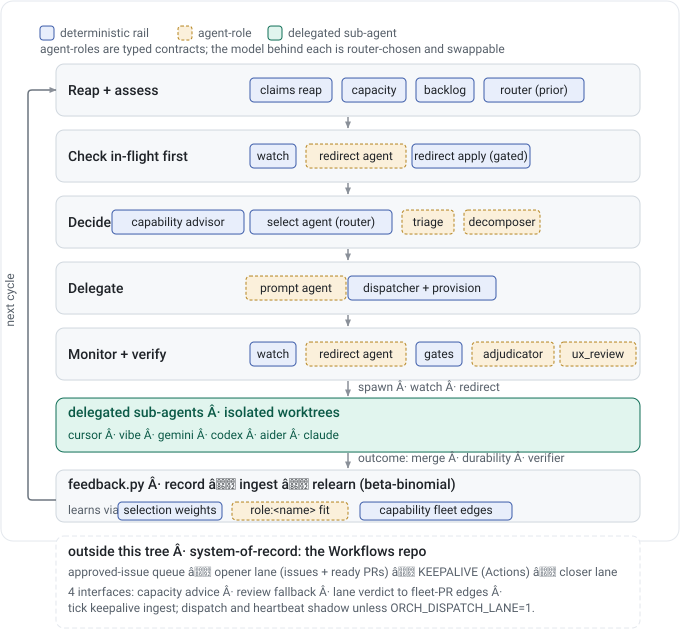

# Orchestrator architecture — rails vs. agent-roles

> **Keeping this current (CONTRACT).** This file and [`orchestrator-loop.svg`](orchestrator-loop.svg)
> are the source of truth for the rails/roles taxonomy and the loop. **Any change to the system's
> stages, components, the rail/role classification, the feedback surfaces, or the role registry
> (`roles.py`) MUST update BOTH this doc and the diagram in the same change.** `PLANNING.md` and
> `ORCHESTRATOR.md` point here — do not let them drift. If you touch `roles.py` / `route_role` / the
> registry, or move a component across the rail/role line, updating the diagram is not optional.



## Where this sits in the larger pipeline (READ FIRST)

**This document describes ONE COMPONENT.** Everything below — rails, roles, the feedback loop — is
internal to the Orchestrator. The pipeline it participates in has its **system-of-record in the
`Workflows` repo**, and nothing in this file can tell you what that pipeline is doing. Reading only
this document has already produced confidently wrong fleet-level conclusions.

```
  repo review (Workflows)  ->  human-decision packet  ->  APPROVED-ISSUE QUEUE (steward repo)
                                                                    |
                                                     opener lane (local, outside this tree)
                                                     creates issues + draft PRs, own PR cap
                                                                    |
                                        KEEPALIVE (Workflows GitHub Actions) drives each PR:
                                        agent:* label + green Gate + unchecked tasks -> rounds,
                                        stands down when all acceptance criteria are checked
                                                                    |
                                                     closer lane (local) merge -> verify -> close
```

**The Orchestrator's three real interfaces to that pipeline:**

| Interface | Direction | What it is |
|---|---|---|
| `capacity.py` | pipeline → here | The lanes read it to choose which agent gets an advisory review |
| `orchestrator_review` fallback | pipeline → here | A review-fallback path routes an advisory review through this tool |
| `tick.py --active` → `delegate_remote` | here → pipeline | Applies `agent:*` labels, driving keepalive on REMOTE capacity |

So this tool is a **capacity advisor, a review router, and a keepalive driver**. It is **not** the
fleet's work-discovery engine: `backlog._is_ready()` is this tool's own private discovery path, and
the fleet's work originates from the approved-issue queue, not from `status: ready` labels.

### Two things that will mislead you if unstated

**The word "orchestrator" is overloaded.** The keepalive contract in `Workflows` has a section headed
*"Orchestrator Invariants"* which means the **GitHub Actions concurrency and round orchestration** —
a different system from this repository. When a Workflows doc says "the orchestrator", assume it means
the Actions workflow until proven otherwise.

**Double-dispatch is prevented by a coarse heartbeat, not a per-target lock.** `orchestrate.sh
--active` writes a freshness heartbeat; the lanes' prerun reads it and yields that round. Fail-open —
absent, stale or malformed means the lanes proceed normally. One side drives at a time, but the
exclusion covers a whole ROUND (~15-minute freshness), not an individual issue. `claims.py` is local
and does **not** span the lanes' GitHub execution, so do not add a dispatch path that assumes
per-issue locking.

**Metrics from this tree are scoped to this tree.** `backlog.json` counts, `issue_readiness` verdicts
and `true_open` describe this tool's own dispatch lane, never fleet throughput.

## The one rule: selection stays deterministic; judgment becomes agent-roles

The discriminator for "should this be an agent?" is **who decides the next step — code or the model.**

- **Do NOT agentify the Decide stage's selection step.** Choosing *which agent/LLM* does a piece of
  work (`router.select_agent`) looks like judgment, but it is a **learned policy**, not an LLM call —
  and it is the signal `feedback.py` estimates. Replacing it with an LLM would (a) blur the
  credit-assignment the learner depends on, (b) add per-item token cost, and (c) make routing
  non-reproducible and un-A/B-able. Selection is the place that **stays code**. The agentic layer may
  *override* the router (the seat already does), but the router itself is a rail.
- **Agentify judgment under an open/ambiguous action space** — redirect, decompose, triage,
  prompt-authoring, adjudication. Each becomes a **typed agent-role** whose LLM backend is **swappable
  and router-chosen**.

## Reading the diagram

The five boxes are the orchestrator's cycle (`ORCHESTRATOR.md` → "Your loop, each cycle"). Inside each
stage, every component is tagged:

- **blue = deterministic rail** — code. Keep it predictable; determinism is the safety/auditability property.
- **amber, dashed = agent-role** — LLM judgment behind a typed contract; the model is swappable.
- **teal = delegated sub-agent** — the worker CLIs spawned in isolated worktrees.

The single left arc is the loop closing. What it carries back is the point: `feedback.py` relearns
**both** surfaces — `selection weights` (blue) and `role ↔ backend fit` (amber) — into the next cycle.

## Rails — deterministic, keep as code

`router` (selection) · `claims` · `capacity` · `provision` · `dispatcher` (transport) · `adapters` ·
`feedback` (the learner/store) · gates (`testgen_gate`, `local_verify`, `merge_guard`,
`runtime_ac_gate`, `frontend_verify` (Gate 1), `ux_review.gate_decision` (Gate 2 pass-requirement)).

Determinism here is load-bearing: the claims/capacity/provision rails are what the "0 unsafe
delegations" guarantee rests on, and the gates guard terminal merges and must stay auditable. An
LLM verifier (a review panel) is a *supplement* to a gate, never a replacement for it.

## Agent-roles — judgment, typed contract, swappable backend

A role is defined in `roles.py` as `Role(name, route_as, eligible_backends, mode, build_prompt,
validate)`. `route_role(role, cap)` reuses `router.select_agent` restricted to the role's
`eligible_backends` (RESERVE seats — claude — excluded by default, allowed only as last resort or
`high_leverage=True`). So **role-backend choice obeys the same capacity + learned weights as worker
selection**, and every role becomes a **new learnable surface**: `exp_abcd` / `feedback` can learn the
best backend *per role* the same way they learn the best implementer per task_type.

`route_as` is an **existing `ROUTE_TABLE` task_type used only as the routing prior**. Once a role has
accepted downstream outcomes, `route_role()` prefers learned weights for `role:<name>` and falls back to
`route_as` only while that role-specific surface is cold.

| role | replaces / upgrades | judgment it adds | status |
|---|---|---|---|
| **RedirectAgent** | `redirect_policy` heuristics | read log+diff+AC → action + corrected prompt | **built, shadow (2026-06-19)** |
| **PromptAgent** | dispatcher generic templates | issue → scoped prompt + definition-of-done | **built, shadow (2026-06-20)** |
| **DecomposerAgent** | `epic_lane` planner prompts | vague/large goal → subtask DAG | **built, shadow (2026-06-20)** |
| **TriageAgent** | `backlog` worth-it filter | which items now, skip underspecified, batch | **built, shadow (2026-06-20)** |
| **AdjudicatorAgent** | `runtime_ac_panel` / `adversarial` dispute step | verify a lone reviewer veto vs. ground truth | **built, shadow (2026-06-20)** |

## The feedback loop closes over both surfaces

`feedback.py` learns (1) **router weights** — which agent per task_type — and (2) **role ↔ backend
fit** — which LLM per role. Both return to the next cycle. Surface (2) is wired through role runs:
`feedback.record_role_run()` records a `task_type='role:<name>'` decision, and the downstream run's
outcome comes back to that role run over an **accepted influence edge**. That link forms automatically at
the dispatch seam — the accepted `role_run_id` is stamped onto the dispatch
(`dispatcher.delegate --influenced-by-role-run-id`, emitted into the plan by
`redirect_plan.attach_role_lineage`), `feedback.record_run()` writes the `influence_type='role'` edge, and
`feedback._propagate_outcome_lineage_in_conn()` back-propagates the acting run's terminal verdict when it
lands. `feedback.join_role_to_outcome()` is the manual equivalent for links made after the fact.
Attribution is to the ACTING run: only an `accepted=1` edge back-propagates, so a role whose proposal was
rejected records the disagreement and inherits no PASS. This keeps role learning separate from normal
implement/review weights while still using the same `relearn_quality()` machinery.

## The capability layer — what the tool can do, and how a surface finds it

This doc described rails and roles and never once said "capability", which let a whole session treat
the two axes as one. They are orthogonal:

- **rail vs. role** is *how a thing is implemented* — deterministic code, or LLM judgment behind a
  typed contract with a swappable backend.
- **capability** is *what a tool in the Orchestrator does*. It is the unit of accounting, and one
  capability routinely spans both (`adversarial-review` is role judgment, invoked by a rail gate,
  recorded over a deterministic acceptance edge).

The eight admission parts (`ADDING_CAPABILITIES.md`) are **not** the definition of a capability. They
are what must be present for one to work with this system — invocable, observable, improvable.

**Two kinds, and their measurement stories differ.** *Workflow* capabilities run implementation code
and have a definable success condition, so effectiveness is a pass/fail rate. *Sub-agent* capabilities
spin out a bounded, goal-scoped agent whose backend is router-chosen, so effectiveness is **backend
fit** and needs arm + member identity. Never average across the two kinds.

### Selection: three layers, because offering is all you can do

A capability is *offered*, never mandated — the calling agent may have a better way to do the work,
and constraining it to use a tool because we built it would be worse than it choosing otherwise. So
the design problem is not compulsion, it is **raising the probability the right capability is chosen**.

The published measurements say catalogue size is the dominant factor. Selection accuracy runs
84–95% at ~50 tools, 41–83% at 200, and near zero at 740, with a practical safe zone of **10–20 per
reasoning context** and a "lost in the middle" effect dropping mid-list selection to 22–52%. RAG-MCP
measured the fix: full catalogue exposed gave **13.62%**, top-3-of-15 gave **43.13%**. Anthropic's own
subagent guidance names the same failure — auto-selection is unreliable, and a session often does the
work itself even when a subagent's description matches cleanly.

So a 40-plus capability catalogue queried generically is the 13.62% condition, and the three layers
are ordered by when each starts working:

| Layer | Mechanism | Works from |
|---|---|---|
| 1 | `capability_advisor.SURFACE_BINDINGS` — declared, per surface, 3–7 entries, each with its reason | day one; no classifier, no history |
| 2 | `capability_propensity.rank` — orders *within* the bound set by measured usefulness | first resolved trials |
| 3 | `capability_advisor.learned_associations` — corrects the table from what a surface actually reaches for | once observations accumulate |

Layer 1 is a **rail**: a declared table plus a deterministic keyword classifier, no model call. The
committed table is the seed (tool); instance promotions live in the ledger (evidence).

**Binding prioritises, it never conceals.** Unbound capabilities are still returned, ranked after the
bound set and flagged `bound: false`. A concealed capability could never be selected, so it could
never earn the evidence that would bind it — the gate would starve its own drain.

**And a fourth input, orthogonal to all three: the per-repo contraindication.** The three layers above
rank a capability by how well it fits the SURFACE. None of them can say *this tool does not work
against this particular repository* — a fact that lives in the repo's own record, not in the ledger.
A real audit run was offered `frontend-verifier` and `repo-playbook` in the same response for a repo
whose audit history says `frontend_verify.py` snapshots its Streamlit SPA before the websocket render
completes; the two bound capabilities contradicted each other and the reconciliation existed only in
the auditor's head. `repo_knowledge`'s `contraindications` section now carries `{capability, reason,
instead, evidence}` per repo, and `capability_advisor.advise(repository=…)` annotates matching
candidates on both answer paths — the classified one and the classification-miss one a free-text
consult actually lands on. It follows the same two rules as binding: it **annotates, never removes**
(a concealed candidate can never earn the evidence that would clear it), and it is **data, not prose**.
It is deliberately **repo-scoped rather than surface-scoped**: a demotion learned here would unbind
the capability for every other repo, which is the wrong granularity for "broken against this one app".

**And the binding is DATA, not prose, deliberately.** The recursive loop below must be able to change
what a surface reaches for without rewriting that surface's prompt. `CLAUDE.md` §1 makes the manual
mirror sync "the only circuit breaker between an agent's change and the dispatcher that dispatches
those agents"; a loop that edits lane prompts is a self-modifying dispatch path. A surface's prompt
says *consult your bound set*; the bound set is a table.

### The recursive loop (both halves built)

Selection should improve where it should have been chosen and was not. Three detectable signals,
strongest first:

1. **The surface did the capability's work by hand.** Measured, not hypothetical: the opener performed
   `deliberate-break-verifier`'s exact break-then-revert contract in 271 of 2,445 rounds while never
   invoking it — and that practice appears nowhere in its instructions, only in its rolling memory.
2. **Named but not triggered, and the round went badly.** The control arm of every propensity
   experiment is exactly this candidate set; `influence_edges.counterfactual` already carries the column.
3. **Post-hoc failure attribution.** A verifier follow-up exists because merged work missed its own
   criteria → `runtime-ac-checks` should have run.

Implemented in `capability_propensity`: `hand_work()` scores signal 1 against a surface's own
records, `missed_selection()` reports all three, `propose_bindings()` / `propose_demotions()` emit
the actions, and `record_promotion()` writes a `binding_promotion` event that `binding_for()` reads —
so the loop closes as a **data change**, with no prompt rewritten. `detect` runs it across every
surface whose records resolve on this machine; the tick calls it REPORT-ONLY (`--apply` exists and is
deliberately not passed, matching how `feature_scan` is wired).

Signal 3 is consumed, not recomputed: `capability_matcher_proposals.evaluate()` already scores
"should work have been ROUTED here" against the Brain's run history and reports 6 capabilities across
379 runs of matching work never invoked. It was itself a built-and-forgotten module — working report,
no caller, no ledger row. Note its limit: `runs` has no surface column (`runs.source` holds only
keepalive / orchestrator_local / orchestrator_remote), so run history says a capability is under-used
OVERALL and cannot say which surface passed it over. That is why signal 1 exists and why a promotion
is never derived from run history alone.

### Where layer 2's evidence comes from

Layer 2 needs resolved trials, and until 2026-08-22 nothing produced any: `advise()` recorded the
`match` edge, and the `invocation`/`outcome` edges had no production caller at all, so every
propensity was the prior and the cadence step said so on every run. **The tick is now that
producer** (`capability_propensity.py tick-evidence`, every tick, below the heartbeat export and
below the four steps it grades) — chosen because it is the highest-volume unattended surface, so
coverage accrues hourly with no further attention.

An observer's verdict is **not** a delivery verdict — a cadence report can never merge a PR, and
demanding one is the category error that parked eight capabilities in a measurement gap they could
not leave. For the tick-bound capabilities that `capabilities.is_observer()` confirms, *helped* means
**its report's finding set changed since its own previous run**: a defect newly reported, a
regression flagged, a switch verdict that moved, a finding resolved. Re-emitting an identical finding
set is *not* useful, and an empty set that stays empty is explicitly not useful — silence is not
usefulness. Capabilities the observer test does not confirm record that they ran and get no verdict,
because averaging an output-change question with a delivery question would violate the never-average
rule two paragraphs up.

The bounding is a correctness requirement, not a nicety: 24 ticks a day over four bound capabilities
is 96 potential data points, and a verdict written on every run would make the ranking measure the
cadence. Two independent bounds — the experiment id is scoped to the UTC day, so the ledger's
idempotency keys admit at most one verdict per capability per day whatever happens; and a verdict
additionally requires that capability's own cadence artifact to have been regenerated since the last
evaluation, which ties one verdict to one production and bounds the graded rate to ~1.3/day. The
finding projection keeps identity and verdict fields only, because `overdue`'s `silent_days` rises
daily on its own and hashing a row whole would score the monitor useful on every run it will ever
make.

**Demotion is the drain.** Bindings that could only grow end with every surface holding all 43 —
the exact condition binding prevents. Two rules propose removal, and they read **disjoint
populations**: `never_triggered` counts offers where nothing was said (`not_triggered_silently`)
across `DEMOTION_MIN_TRIALS`; `declined_with_reason` counts *demotable* declines across
`DEMOTION_MIN_DECLINES`, a much lower floor because a stated reason is much better evidence. A single
trigger at that surface disqualifies both — something actually used there is not a demotion candidate
however often it is passed over. The disjointness is not tidiness: counting declines as silent offers
lets an honest decline of a *correct* match trip the rule meant for capabilities nobody spoke about.

**A DECLINE IS A THIRD STATE, NOT A NEGATIVE OUTCOME** (`capability_propensity.record_decline`, CLI
`decline`, MCP `capability_decline`). Two independent audit rounds on 2026-08-23 reached the same
finding: propensity carried information exactly once, because most candidates sat at the
uninformative prior, and the missing input was not more consults but reasoned rejections — a
capability declined on repo-specific grounds looked identical in the ledger to one nobody ever
considered. So `triggered` / `declined` / `not_triggered_silently` now partition the candidate set,
and *never considered* is the fourth case of not being a candidate at all.

The discipline that makes this safe is a separation, not a convention. A decline means the capability
did NOT run, so recording it as an `outcome` would bucket it into `not_useful` — asserting we tried
it and it did not help, about something that never executed, corrupting the one signal declines
exist to sharpen. A decline is therefore carried on a `match` event (it genuinely *was* offered)
tagged `source=capability_decline`, and `usefulness()` reads `outcome` events only. There is no code
path from a decline to the posterior. `propensity()` reports the decline count **beside** the
posterior for exactly this reason: "prior, no evidence" and "prior, no evidence, four reasoned
rejections" are opposite readings that were previously identical. A decline requires a reason and is
refused without one, the same way `record_usefulness` refuses an unevidenced verdict.

Attribution is on the event: the advisor records the `surface` on each `match`, because it recorded
only `skill` before and the CLI has no `--skill` flag — so every `--surface` consult wrote
`skill: null` and its whole control arm was unattributable to the surface that produced it.

**And a decline has a KIND, because the kinds imply opposite corrections.** One undifferentiated
"declined" column licenses the wrong fix. A third audit round on 2026-08-23 separated them and the
separation is the finding: `testgen-lane` matched **correctly** three times in a read-only audit and
was structurally impossible every time (no commit target), while `offload` was declined at 9 of 12
surfaces because it is declared surface-wide and a one-subsystem audit has nothing big enough to hand
off. The first calls for no change at all; the second calls for a precondition or a narrower
declaration. And `frontend-verifier` — declined on two frontend-less repos, then the
second-strongest finding of an audit on a repo that *does* have a display surface — is the same
lesson from the other side: two negatives are not a verdict on a binding.

So `demotable` is a property of the **kind**, declared once in `DECLINE_KINDS` and read nowhere
else. `wrong_match` and `scope_too_small` may demote; `precondition_unmet`, `no_landing_zone`,
`gated_off`, `deferred` and the `unspecified` default may not — they are counted and reported, and
cannot clear the floor. `precondition_unmet` is the load-bearing one: the correct response to a
capability whose condition does not hold here is to **evaluate the condition, not to weaken the
binding**, which is why it is recorded and inert. An unknown kind is refused rather than coerced,
because a typo silently becoming `unspecified` would discard the classification the caller believed
it had made.

First live run found a real gap: `deliberate-break-verifier` showed 69 hand-done instances in 1,765
closer rounds while bound only to the opener, and the loop promoted it. **It must not ratchet:** raising selection pressure whenever a capability was not chosen,
while "should have been chosen" is partly derived from that capability's own advocacy, optimises the
measured number rather than usefulness. Promotion is therefore gated on an *external* signal (1 or 3
above), never on the advisor's own naming.

## Gate 2 — the usability review panel (`ux_review.py`, built 2026-06-22)

Frontend work has two gates. **Gate 1** is `frontend_verify` (a deterministic rail: assert→click→assert
on the accessibility tree — *does the control do what it claims*). **Gate 2** is `ux_review` — an
evidence-bound *usability* review by an anonymized panel of ≥4 evaluator backends plus an adversarial
critic, scoring four dimensions (`wired` / `usability` / `help_clarity` / `workflow_productivity`) where
every sub-8 score must cite screen + click-path + expected-vs-actual (no abstract findings).

Per the rule above — *an LLM review panel is a **supplement** to a gate, never a replacement* — the
**panel is LLM judgment, not a rail.** The **rail is the deterministic `ux_review.gate_decision`**, which
marks a frontend "done" only when Gate 1 passed AND the panel's `overall_median ≥ threshold` AND there is
no severity-4 blocker. The panel reuses `exp_abcd`'s anonymized-evaluator machinery (`_eval_command`,
`_ensure_min_evaluators`, `_extract_json`) and launches with `dispatcher._net_hygiene_prelude()`
(proxy-scrubbed to match the fleet's clean env).

It is a **new feedback *source*, not a new surface**: it writes the existing `feedback.evaluations`
(per-evaluator UX scores), `evidence_gaps` (the self-evolving "what evidence did I lack?" growth layer),
and `human_calibration` (the weekly owner spot-check that anchors the panel). `ux_review.cross_repo_patterns()`
queries `evaluations` to surface a flaw recurring across apps as a prior for the next review. Evaluator
disagreement (score spread ≥3, or a contested severity-3/4 finding) is **flagged → routed to human
calibration**, never averaged away — so "the panel agreed" can't masquerade as "the panel was right."

**The score is not the deliverable — the improvements are.** `ux_review.synthesize_improvements(report)`
mines the panel for *how to make it better*: it preserves every distinct per-evaluator `fix_hint`
behind each corroborated finding (the merge used to keep only one) and ranks them by
severity×corroboration, and it surfaces the unioned `evidence_gaps` as the **coverage to drive next
pass**. Two operational disciplines (in the `/ux-review` skill, not the orchestrator rails) keep this
honest: (1) a **full-coverage pass** — drive *every* primary surface, recording a `coverage` ledger in
the bundle so a happy-path-only review can't post a falsely clean score; (2) a **diff-anchored in-repo
`docs/ux-review/REVIEW_LOG.md`** — each run records the reviewed commit SHA + coverage + finding
dispositions, so the next run `git diff`s that SHA→HEAD and concentrates on new + likely-affected
functionality. These extend the existing component; they add no new rail, role, or `feedback.py` surface.

## RedirectAgent — the first role (built 2026-06-19)

The highest-value autonomy gap is closed-loop monitor→redirect: `ORCHESTRATOR.md` names redirect "your
defining skill / the thing a deterministic dispatcher cannot do," its absence compounds (a drifting
unattended agent isn't caught until a bad outcome hours later), and the scaffolding already existed
(`watch.py` → `policy_decision` + `redirect_plan.py` dry-run/apply). So redirect is the first amber box.

- **Contract.** Input `{report (a watch.py report), acceptance_criteria[, attempt_history]}` →
  `{action ∈ wait|collect|inspect|redirect|decompose, reason, confidence, corrected_prompt, switch_agent}`.
- **Routing.** `route_as="review"` (prior only), `eligible_backends={gemini, codex, cursor, claude}`,
  claude reserved.
- **Shadow only — never mutates.** It proposes into `redirect_plan.plan()` by injecting its decision as
  `report["policy_decision"]` and passing its authored prompt via the new `prompt_override` param. The
  existing `redirect_plan.py --apply --confirm-target` remains the **single human/seat-gated mutation
  path**. An invalid proposal is rejected and falls back to the deterministic `redirect_policy.decide`
  baseline.
- **Rollout discipline (do not skip).** advisor → measure proposal quality vs. outcomes → *only then*
  autonomous action. `redirect_shadow.py` is the measurement layer: it records real RedirectAgent
  proposals against the deterministic baseline, links accepted/applied advice to downstream outcomes, and
  reports `ready_for_supervised_apply`. Historical keepalive-shadow rows may identify replay candidates,
  but are not proposal evidence until rerun as fresh/blinded RedirectAgent proposals and outcome-linked.
  This is the same shadow → supervised → live ramp used for cron activation. The diagram shows the target
  architecture; the amber boxes light up one at a time, redirect first.

### CLI

```bash
python3 roles.py --selftest                       # offline contract checks
python3 roles.py route --role redirect            # show the router-chosen backend
python3 roles.py redirect --report-json r.json --ac "<acceptance criteria>" \
    [--proposal-json p.json]   # replay a captured proposal (offline)
python3 roles.py redirect --report-json r.json --ac "..." --dispatch   # live offload to the backend
python3 redirect_shadow.py record --report-json r.json --ac "..." --dispatch
python3 redirect_shadow.py summarize
python3 redirect_shadow.py historical-candidates
python3 redirect_shadow.py link-outcome --role-run-id RID --influenced-run-id DOWNSTREAM_RID
python3 roles.py link-outcome --role-run-id RID --influenced-run-id DOWNSTREAM_RID
```

All `redirect` invocations print a dry-run plan and a SHADOW banner; none mutate state. Live dispatches
also return `role_run_id` plus the backend offload `run_id`, and an accepted proposal's plan carries that
id on its `delegate-retry` argv (`--influenced-by-role-run-id`) so the downstream run stamps itself.

**Applying is machine-authorised, not reviewed** (`redirect_apply.py`, 2026-08-21). `redirect_plan.apply_plan`
had no caller at all, and the Stage-2 gate that would authorise one (`ready_for_supervised_apply`) counts
only *applied* advice — `join_role_to_outcome` returns `synced=False` for unaccepted links and historical
replay links are deliberately `not_role_learning=True` — so the gate required ten applied outcomes before
anything could apply. `redirect_apply.py` breaks that deadlock at both ends: `link_applied_outcomes()`
turns each applied redirect's own influence edge into the corpus link automatically, and a default-OFF,
self-disabling bootstrap (`ORCH_REDIRECT_APPLY_BOOTSTRAP`) applies at most one authorised plan per day.
Authorisation is a pure function of recorded state — dead prior process, no foreign claim, lineage stamp
present, gate deficit still open, per-target and per-day bounds — never an owner review queue.

## PromptAgent — the second role (built 2026-06-20)

PromptAgent upgrades generic delegation templates without changing deterministic selection. It turns
`{target, goal, task_type, lane, context}` into a strict JSON prompt proposal containing a standalone
`scoped_prompt`, `definition_of_done`, acceptance criteria, validation, expected paths, out-of-scope
boundaries, risks, and confidence.

- **Routing.** `route_as="implement"` (prior only), `eligible_backends={gemini, codex, cursor, claude, vibe}`,
  claude reserved by default through `route_role()`.
- **Shadow only — never delegates.** It returns a dispatch-ready prompt string for the orchestrator to
  inspect. It does not call `dispatcher.delegate`, write claims, label PRs, create branches, or open PRs.
- **Rail preservation.** The output `task_type` must match the deterministic rail-selected input
  `task_type`; PromptAgent may not reclassify work or replace `router.select_agent`.
- **Validation.** The role rejects missing DoD/AC/validation, task-type mismatch, agent persona leakage, and
  duplicated repo-playbook text because dispatcher injects persona and approved repo context.

### CLI

```bash
python3 roles.py route --role prompt
python3 roles.py prompt --target owner/repo#N --goal "..." --task-type implement \
  --target-detail "issue body or PR context" [--proposal-json p.json]
python3 roles.py prompt --target owner/repo#N --goal "..." --task-type implement --dispatch
```

## DecomposerAgent — the third role (built 2026-06-20)

DecomposerAgent upgrades the epic planning lane into a callable role. It turns a large/vague goal into an
`epic_lane.py` plan: epic metadata, dispatchable subtasks, dependencies, integration order, final
verification, and re-decomposition triggers.

- **Routing.** `route_as="epic"` (prior only), `eligible_backends={gemini, codex, cursor, vibe}`,
  matching the existing epic-lane prior while learning `role:decomposer` separately.
- **Shadow only — never dispatches.** It returns validated `dispatch_prompts` for the orchestrator to
  inspect. It does not call `dispatcher.delegate`, write claims, label PRs, create branches, or open PRs.
- **Validation.** The role reuses `epic_lane.validate_plan()` and `epic_lane.build_dispatch_prompts()` so
  the CLI lane and role lane cannot drift. Invalid proposals fall back to the deterministic planner prompt
  only; no dummy dispatchable plan is emitted.

### CLI

```bash
python3 roles.py route --role decomposer
python3 roles.py decompose --goal "..." --repo owner/repo --target owner/repo#N \
  [--subtask-count 3] [--proposal-json plan.json]
python3 roles.py decompose --goal "..." --repo owner/repo --dispatch
```

## TriageAgent — the fourth role (built 2026-06-20)

TriageAgent upgrades the backlog worth-it pass into a callable role. It turns a discovered backlog snapshot
into advisory recommendations: work now, defer, needs scope, skip, monitor, and optional logical batches.

- **Routing.** `route_as="review"` (prior only), `eligible_backends={cursor, vibe, gemini, codex, claude}`,
  with claude reserved by default through `route_role()`.
- **Shadow only — never selects workers or mutates backlog state.** It does not call `router.select_agent`,
  `dispatcher.delegate`, claims, label mutation, branch creation, or PR actions. Router capacity, claims,
  task type, lane, and worker selection remain deterministic rails.
- **Validation.** The role requires exactly one recommendation for each visible target, rejects unknown or
  duplicate targets, rejects unregistered batch IDs, forbids extra recommendation/batch keys that could
  smuggle worker selection or task reclassification, and falls back to deterministic backlog order when a
  proposal is invalid.
- **Input quality.** `backlog.py` now retains issue/PR `body` text so triage can judge underspecification
  from more than titles and labels.

### CLI

```bash
python3 roles.py route --role triage
python3 roles.py triage --backlog-json ~/.codex/handoff/backlog.json [--proposal-json triage.json]
python3 roles.py triage --backlog-json ~/.codex/handoff/backlog.json --dispatch
```

## AdjudicatorAgent — the fifth role (built 2026-06-20)

AdjudicatorAgent upgrades disputed-reviewer handling into a callable role. It reviews one blocker/veto
against supplied ground-truth evidence and advises whether to uphold it, reject it, or gather more
evidence.

- **Routing.** `route_as="review"` (prior only), `eligible_backends={gemini, codex, claude}`. Claude is
  reserved by default through `route_role()`, so routine shadow adjudication starts with Gemini/Codex.
- **Shadow only — never emits terminal verifier verdicts or mutates.** It does not produce `PASS`, `FAIL`,
  `BLOCKED`, or `verifier_verdict`, and it does not call merge/label/claim/delegate paths.
- **Rail preservation.** `runtime_ac_panel.adjudicate_panel()` and `adversarial.aggregate_veto()` remain the
  deterministic aggregation math. Automated gate failures still block through the gate/merge rails; an
  adjudicator recommendation is evidence for the orchestrator/human to inspect, not an override.
- **Validation.** The role rejects terminal/mutating keys, requires cited ground-truth refs when upholding
  or rejecting a blocker, requires evidence gaps for `needs_more_evidence`, and rejects next steps that ask
  for mutating execution.

### CLI

```bash
python3 roles.py route --role adjudicator
python3 roles.py adjudicate --case-json case.json [--proposal-json adjudication.json]
python3 roles.py adjudicate --case-json case.json --dispatch
```
