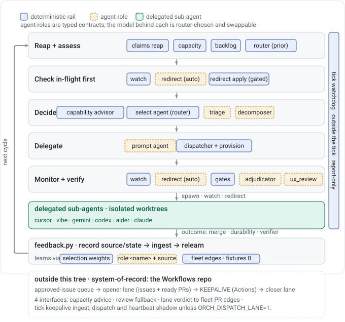

# Orchestrator architecture — rails vs. agent-roles

> **Keeping this current (CONTRACT).** This file and [`orchestrator-loop.svg`](orchestrator-loop.svg)
> are the source of truth for the rails/roles taxonomy and the loop. **Any change to the system's
> stages, components, the rail/role classification, the feedback surfaces, or the role registry
> (`roles.py`) MUST update BOTH this doc and the diagram in the same change.** `PLANNING.md` and
> `ORCHESTRATOR.md` point here — do not let them drift. If you touch `roles.py` / `route_role` / the
> registry, or move a component across the rail/role line, updating the diagram is not optional.



## Where this sits in the larger pipeline (READ FIRST)

**This document describes ONE COMPONENT.** Everything below — rails, roles, the feedback loop — is
internal to the Orchestrator. The pipeline it participates in has its **system-of-record in the
`Workflows` repo**, and nothing in this file can tell you what that pipeline is doing. Reading only
this document has already produced confidently wrong fleet-level conclusions.

```
  repo review (Workflows)  ->  human-decision packet  ->  APPROVED-ISSUE QUEUE (steward repo)
                                                                    |
                                                     opener lane (local, outside this tree)
                                                     creates issues + ready PRs, own PR cap
                                                                    |
                                        KEEPALIVE (Workflows GitHub Actions) drives each PR:
                                        agent:* label + green Gate + unchecked tasks -> rounds,
                                        stands down when all acceptance criteria are checked
                                                                    |
                                                     closer lane (local) merge -> verify -> close
```

**The Orchestrator's four real interfaces to that pipeline:**

| Interface | Direction | What it is |
|---|---|---|
| `capacity.py` | pipeline → here | The lanes read it to choose which agent gets an advisory review |
| `orchestrator_review` fallback | pipeline → here | A review-fallback path routes an advisory review through this tool |
| `capability_propensity --deliverable` → `capability_outcome_bridge` | pipeline → here | Lane verdicts name a PR explicitly; the bridge joins positive versioned verdicts to keepalive runs and records capability influence edges |
| `tick.py --active` → `delegate_remote` | here → pipeline | Applies `agent:*` labels, driving keepalive on REMOTE capacity — **shadow by default since 2026-09-03** (`ORCH_DISPATCH_LANE=1` re-enables): 14 dispatches in 30 days, none shown to be the labelled agent's work — the 5 credited merges were other lanes' work or empty (a local run's PR merged before the label, an empty bootstrap, a bootstrap the closer finished, 2 codex PRs the labelled agent never ran on), the 2 PRs closed unmerged were bootstraps whose agent round never completed, and 7 labelled issues closed with no PR from the labelled agent, 4 of them delivered by codex keepalive or by hand (re-measured 2026-10-04 from keepalive's runner records) — while keepalive ran 1,239 rounds without it |

So this tool is a **capacity advisor, a review router, and (in shadow unless deliberately enabled) a keepalive driver**. It is **not** the
fleet's work-discovery engine: `backlog._is_ready()` is this tool's own private discovery path, and
the fleet's work originates from the approved-issue queue, not from `status: ready` labels.

### Two things that will mislead you if unstated

**The word "orchestrator" is overloaded.** The keepalive contract in `Workflows` has a section headed
*"Orchestrator Invariants"* which means the **GitHub Actions concurrency and round orchestration** —
a different system from this repository. When a Workflows doc says "the orchestrator", assume it means
the Actions workflow until proven otherwise.

**Double-dispatch is prevented by a coarse heartbeat, not a per-target lock.** `orchestrate.sh
--active` writes a freshness heartbeat; the lanes' prerun reads it and yields that round. Fail-open —
absent, stale or malformed means the lanes proceed normally. One side drives at a time, but the
exclusion covers a whole ROUND (~15-minute freshness), not an individual issue. `claims.py` is local
and does **not** span the lanes' GitHub execution, so do not add a dispatch path that assumes
per-issue locking.

**Metrics from this tree are scoped to this tree.** `backlog.json` counts, `issue_readiness` verdicts
and `true_open` describe this tool's own dispatch lane, never fleet throughput.

## The one rule: selection stays deterministic; judgment becomes agent-roles

The discriminator for "should this be an agent?" is **who decides the next step — code or the model.**

- **Do NOT agentify the Decide stage's selection step.** Choosing *which agent/LLM* does a piece of
  work (`router.select_agent`) looks like judgment, but it is a **learned policy**, not an LLM call —
  and it is the signal `feedback.py` estimates. Replacing it with an LLM would (a) blur the
  credit-assignment the learner depends on, (b) add per-item token cost, and (c) make routing
  non-reproducible and un-A/B-able. Selection is the place that **stays code**. The agentic layer may
  *override* the router (the seat already does), but the router itself is a rail.
- **Agentify judgment under an open/ambiguous action space** — redirect, decompose, triage,
  prompt-authoring, adjudication. Each becomes a **typed agent-role** whose LLM backend is **swappable
  and router-chosen**.

## Reading the diagram

The five boxes are the orchestrator's cycle (`ORCHESTRATOR.md` → "Your loop, each cycle"). Inside each
stage, every component is tagged:

- **blue = deterministic rail** — code. Keep it predictable; determinism is the safety/auditability property.
- **amber, dashed = agent-role** — LLM judgment behind a typed contract; the model is swappable.
- **teal = delegated sub-agent** — the worker CLIs spawned in isolated worktrees.

The single left arc is the loop closing. What it carries back is the point: `feedback.py` relearns
**both** surfaces — `selection weights` (blue) and `role ↔ backend fit` (amber) — into the next cycle.

## Rails — deterministic, keep as code

`router` (selection) · `claims` · `capacity` · `provision` · `dispatcher` (transport) · `adapters` ·
`feedback` (the learner/store) · gates (`testgen_gate`, `local_verify`, `merge_guard`,
`runtime_ac_gate`, `frontend_verify` (Gate 1), `ux_review.gate_decision` (Gate 2 pass-requirement)).

The runtime-AC rail also has a non-blocking observation edge: keepalive ingest authors one
issue-derived shadow spec per new linked PR, and switch review consumes its existing Brain
completion events. Authoring extracts named tests, retains uncertain obligations as manual,
and records per-check confidence. Execution still requires the existing runtime/command
switches and an exact PR checkout; an absent checkout is unmeasured. Shadow specs never
implicitly enable merge enforcement or patch delivery outcomes. Coverage-only pytest options
are removed for named acceptance checks so test success and coverage policy cannot disagree.

Codex model and reasoning selection is also a deterministic rail: `execution_profiles` maps
the task and lane to an immutable profile, `router` records the selected profile, and
`dispatcher` passes its model and effort to `adapters`. An explicit `--profile-id` on a
bounded offload or delegation chooses that exact profile; it does not create a new role or
change the feedback loop. Operator `ORCH_CODEX_MODEL_*` pins and `ORCH_CODEX_MAX_TIER` ceilings
continue through the tier adapter for automatic routes; the explicit profile stays exact.

Determinism here is load-bearing: the claims/capacity/provision rails are what the "0 unsafe
delegations" guarantee rests on, and the gates guard terminal merges and must stay auditable. An
LLM verifier (a review panel) is a *supplement* to a gate, never a replacement for it.

**The guarantee's two ownership reads answer three ways, and unknown refuses (2026-10-04).** Before
`delegate_remote` labels a target, the tick asks `claims.holder` whether a local claim holds it and
`dispatcher._target_labels` whether GitHub shows it paused or carrying an `agent:*` label. Each read
can say "owned", "free", or "could not tell". Until this date "could not tell" came back as "free".
A failed `gh` read returned an empty label set, and the rail labelled two PRs that had carried
`agent:codex` for hours (Trend_Model_Project#5913, #5944), each in a tick that skipped a neighbour
for the same label. A held claim with unreadable meta returned None, and claim meta was rewritten
in place, so a read caught between truncation and write made an old live claim look stale. Now an
unknown answer refuses the target, with the reason in the plan, in shadow and live ticks alike, and
claim meta is replaced in one step (`claims._write_meta`). The tick headline prints
`label reads A answered, U unanswered (refused)`. Nothing is cached, so the next tick's read clears
a refusal as soon as GitHub answers. (No stage, component or surface moved; the diagram is
unchanged.)

**A refusal takes no delegation slot (2026-10-04).** The tick's per-tick cap
(`ORCH_MAX_REMOTE_PER_TICK`, default 3) used to count every row that reached `delegate_remote`,
refusals included. Discovery lists a closer item only when its PR already carries an `agent:*`
label, and lists closer items first, so the cap filled with refusals. Over the live period
(2026-06-15 to 09-02), 2,826 of its slots went to refusals and 25 to delegations, and 65 targets that
carried no agent label when first deferred were never examined. `tick.is_delegation` is now the one
predicate the cap, `production_reserve`, the rejected-role influence edge and the `TICK-PLAN`
headline consume. A second bound, `EXAMINED_PER_DELEGATION` (4) times the cap, limits the items a
tick examines, so a backlog of owned PRs cannot turn into unbounded label reads. Items the rail
refuses on their discovery labels are examined after the rest (`tick.examination_order`), so they
cannot hold a delegable item behind that bound. The plan and the headline print each bound beside its
count, and the deferred items' blocking quantity (`delegable`) beside the drainable one.
In an active tick the cap's deferrals are drainable only when at least one cap-filling label
applied; a failed POST still consumes the spend bound but leaves its target unowned to take its slot
again. (No stage,
component or surface moved; the diagram is unchanged.)

**The rejected-role edges written for refusals are deleted once (2026-10-05).** Before that change
the tick wrote its rejected-role edge for every row, and a refusal records no run. The Brain held 210
such edges. The tick logs place 208 of them in a tick that refused the target: 78 point at a run
nothing recorded, 25 were written before the run's first recording and linked by its back-fill, and
105 were written by later ticks that refused a target its delegation had left owned. Each says a role
was overruled by a run that never saw it. A one-time data migration in `feedback.py`
(`influence_edges.refusal-role-edges-2026-10-05`) deletes those rows and keeps an edge written within
300 s after a recording of its run. `runs.ts` holds only the latest recording, so the first is read
from the run's completion events. It selects only the tick's own rows: role, `remote:` target,
rejected, no capability, the tick's metadata hash. The 2 edges from delegating ticks stay. The
deleted rows are kept in the migration's marker, and `feedback.py restore-refusal-role-edges` puts
them back. `completion_event_health` orphans fall from 298 to 220. The rest are capability edges, so
`dry_seam_audit` still fails on them. (No stage, component or surface moved; the diagram is
unchanged.)

**The closer-PR review hooks run at the merge, not before a delegation (2026-10-05).** Discovery
lists a closer item only for a PR that already carries an `agent:*` label, and the dispatcher refuses
every such label, so the tick can never delegate one. It still ran three hooks on each: the
runtime-AC gate, the adversarial panel for a high-stakes one, and the adjudicator on their
disagreement. None could change an outcome, and nothing read the panel's result. In the 30 days to
2026-10-06 they wrote 1,243 runtime-AC gate events for fleet PRs, every one `skipped`; 851 were shadow
ticks re-examining four PRs that merged on 2026-09-18, from a backlog not refreshed since. The
adjudicator hook recorded 1,777 selector events and matched no case, and the panel would have
re-reviewed the same head on every hourly tick. The
tick now sets closer items aside unexamined: they are named in the plan (`closer_not_examined`), counted on the
TICK-PLAN line, and kept out of research. Their hooks run at the decision a closer PR faces, its
terminal merge. `merge_guard` already ran the runtime-AC gate. It now gives a high-stakes PR the panel,
with the risk label read from the source issue because no fleet PR carries `risk:*`. The panel is
judged once per (PR, head SHA) by `adversarial.review_at_head` and stays advisory, behind the same
flag. The adjudicator is consulted only on a conclusive disagreement. The memo key is a hash over
the head, so a moved head is never shown an old verdict. Only PASS and BLOCKED are reused: an
INCONCLUSIVE panel is a shortfall, and reusing it would forbid its own re-run. A worktree at any other
commit is refused, and nothing is recorded. The Brain keeps the verdict and hashes; the findings
live in a hash-checked artifact beside it. The closer lane, which merges fleet PRs itself, reaches the
same entry through the advisor's `HOW_TO_USE` (`adversarial.py review --target … --head …`).
The panel moved from the Delegate stage to the Monitor + verify gate, so the diagram draws it there.

The adapter also decides each codex run's writable boundary. A run whose job is to commit (a
dispatch from `plan_dispatch`, or an experiment arm) gets `--add-dir` for exactly its linked
worktree's git dir, plus the canonical clone's `objects/`, `refs/` and `logs/`
(`adapters.codex_worktree_git_roots`). Since codex 0.158 that git dir is read-only under
`workspace-write` even inside a broader writable root, and the 2026-10-04 batch could not commit
in place. Offloads, read-only runs and the outer-seat bypass get nothing, and the clone's `config`
and `hooks/` are never granted. No stage, component or surface moved, so the diagram is unchanged.

**No agent run is given a workspace that is or holds `/`, the home dir or the control plane
(2026-10-05).** A run's workspace is where it may write. codex makes `--cd` a write entry of the
run's own permission profile, so `writable_roots` cannot narrow it. agy's `--add-dir` is its write
guard. cursor, claude and vibe have no sandbox and work in the process cwd. The tick runs from
launchd with cwd `/`, and a role offloads with `cwd="."` unless it has a worktree, so 1,521 offloads
ran in `/` from 2026-07-10 to 2026-10-02 (gemini 1,279, cursor 224, codex 18; 1,513 were redirect or
triage role runs), each able to write the whole disk. `adapters.broad_workspace_reason` is the one
predicate. It refuses `/`, the home dir, `~/.codex`, `~/.claude`, the state dir, the local runtime
and the exec mirror, and any directory containing one of them. It compares the spelling and, for
case variants, the directory identity. `dispatcher.offload` replaces a refused workspace before
isolation with a fresh scratch directory under `$ORCH_STATE_DIR/scratch-workspaces`
(`adapters.agent_workspace`). The run still starts. The relocation goes to stderr, the dispatch log,
the agent's prompt, the result's `workspace_relocated` and the ledger's `workspace_relocated_from`.
`plan_dispatch` skips a refused provisioned worktree like a provision failure, because a committing
run cannot work in scratch. `build_command` refuses to emit one for a writable codex run or for agy,
whoever calls it. (No stage, component or surface moved; the diagram is unchanged.)

The dispatcher's agent prelude moves `XDG_CONFIG_HOME` into each agent's runtime, and gh honours
it. Until 2026-10-04 an agent whose dispatcher exported neither `GH_CONFIG_DIR` nor `GH_TOKEN` (a
delegate or offload started from a session, a lane or the check-in runner) read an empty config
and stopped at "gh auth login" before asking the keyring for a token. Agents the tick starts were
never in that state: `orchestrate.sh` exports both and the dispatcher passes its environment
through, so they also carry the tick's `GH_TOKEN`. The prelude now pins `GH_CONFIG_DIR` to the
directory the dispatcher's own gh reads, by gh's own lookup order (`dispatcher.gh_config_dir`).
Relative paths are anchored to the dispatcher's cwd before the child changes directory. The agent
therefore uses the same config; authentication also requires access to that config's credential
store. The pin is a path and adds no token to the agent's argv or environment, and every other
tool keeps the redirect. It works in both directions: gh's own writes (`auth logout`, `auth
switch`, `config set`) from an unsandboxed agent reach that config and keyring entry too, as they
would from the dispatcher's shell. No stage, component or surface moved, so the diagram is
unchanged.

**The detached wrappers name the interpreter of their own python steps (2026-10-05).** The dispatch
and experiment wrappers are `bash -lc` strings that end with python steps: the claim release and the
completion record. Those steps were spelled `python3`, so the login profile picked the interpreter,
and its pick depended on the launcher. Codex Desktop exports conda's variables (`CONDA_SHLVL=1`,
`CONDA_PREFIX`) into every command it runs. With those set, the profile's conda hook took base as
already active and left an older `~/anaconda/bin` first on PATH. That directory's `python3` is an
unsigned x86_64 interpreter from 2016, and macOS kills it at exec. All 31 `rc=137` dispatch runs
show this signature, both steps killed at exec. 27 of the 31 were launched from Codex Desktop
threads (the other 4, in July, left no launcher record), and 0 of the 35 launched from Claude
sessions (33) or `codex exec` (2) died. The 3 Codex Desktop launches that went through `launchctl
submit`, which starts from a clean environment, also survived. The steps now run under the
interpreter running the dispatcher (`adapters.wrapper_python`), and the marker's `release_rc` counts
any later kill. The marker still precedes the completion step, so a step that dies for any other
reason still leaves latency and exit status to backfill. (No stage, component or surface moved; the
diagram is unchanged.)

**An offload's verdict comes from what the agent said, not what it read (2026-10-05).** An offload
fails with exit 70 when the agent reports the `OFFLOAD_INCOMPLETE` marker, and the dispatcher looked
for it anywhere in stdout. A codex run's stdout is its `exec --json` stream in every mode but
`assess`, so it also holds every command the agent ran and every file it read, and the repo-audit
skill's references quote the marker. 30 of the 51 codex offloads recorded as exit 70 carried it
only in command output, all 30 ending `turn.completed`. 16 of them reached the learners as FAILs
and 6 as not-useful `offload` verdicts, and the research program retried their units. For a run
whose argv asked for the stream, the dispatcher now reads only the agent's last message
(`rate_incidents.codex_agent_messages`), where the 12 runs that said the marker said it. A stream
with no message fails as `agent returned no message`. Text output is read as before. Recorded rows
are not rewritten. (No stage, component or surface moved; the diagram is unchanged.)

**An offload's log and run_id are claimed together (2026-10-05).** `dispatcher.offload` read
`time.time_ns()` once for its log name and again for its run_id, and on macOS that clock moves in
whole microseconds, so two offloads started in the same microsecond in one process could share
either name. In the capacity ledger, 4 of the 4,517 offload logs were written by two runs each, and
3 run_ids were carried by 7 runs. A shared log holds both run headers before either run's output, so
the reconcile pass read nothing for one run and both outputs for the other. A shared run_id is one
Brain `runs` row, and the second run replaced the first. `dispatcher._claim_offload_log` now creates
the log with O_EXCL, moves one nanosecond on past a name already on disk, and builds the run_id from
the same number. The name keeps its `offload.<agent>.<ns>.log` shape, and each of the two names
gives the other. Recorded rows are not rewritten. (No stage, component or surface moved; the
diagram is unchanged.)

**A shed seat names what clears it (2026-10-05).** A seat is shed by a marker that
`rate_incidents.ensure_shed` writes with an expiry, an incident and a category, and until this date
`capacity` printed "observed 429 / rate-limit shed flag set" whatever the marker held. One pure
reader, `capacity.shed_marker`, now serves the gate, its reason and the weekly `switch_review`. The
reason names the expiry (UTC), the incident and its category, and says the first capacity read
after the expiry clears the seat. A marker with no readable expiry says it is manual and names the
path to remove, and an unreadable one still holds. A codex refusal's stated reset sets the expiry,
read only from codex's harness error events (`rate_incidents.provider_reset_at`, used by every
recorder of a run). Until then the offload recorded no reset, and two refusals of 2026-09-25 that
named Sep 28 shed for the 6 h cooldown. `switch_review` names every marker, FYI only, and flags one
placed by hand that has held its seat past 14 days, or an expired one still on disk. (No stage,
component or surface moved; the diagram is unchanged.)

**What an agent prints passes one mask before this tool writes or returns it (2026-10-06).** While
gh was broken for dispatched agents, agents fetched a GitHub token another way and printed it, and
the dispatcher kept it wherever it keeps what an agent says: a vibe offload's stdout went into a
world-readable dispatch log and back to the caller, whose driver saved a copy, and two experiment
arms printed it into logs the detached wrapper fills straight from stdout. `credential_redaction`
holds one shape list (GitHub, `sk-` keys, Slack, Google, AWS, LangSmith, JWT, bearer and basic
headers, URL passwords, upper-case `*_TOKEN`-style assignments, PEM keys) plus the exact value of
the gh token file. `dispatcher.offload` masks before it logs or returns. The completion step a
detached run's wrapper already runs (`ledger_reconcile complete`) masks that run's own log segment
in place, for runs started from 2026-10-06 only. The experiment and UX-review panels mask their
output file before parsing it into the Brain. A mask is as long as what it hides, so an in-place
edit moves no byte another writer is still appending after. The agent CLIs' own transcripts
(cursor, agy, vibe, codex rollouts) are written by the CLIs and stay out of reach. A weekly FYI
section of `switch_review` counts the files under the dispatch-log and agent-runtime directories
holding the token's exact value or a GitHub-minted token (its own checksum holds), and edits
nothing. (No stage, component or surface moved; the diagram is unchanged.)

**The tick watchdog is infrastructure around the loop, not a stage of it** (`tick_watchdog.py`,
2026-10-02). launchd starts no tick while one runs, so a tick that never ends is a gate with no
drain, and everything that could report it runs inside the tick: for 5d20h from 2026-09-26 the
symptom was silence. The tick's first lines arm it as a separate process in its own session. It
reports a command past 90 min or a tick past 3 h with the exact `kill` that frees it, and is
report-only by the owner's decision. It is deterministic code, so a rail by the definition above,
but it selects nothing, gates nothing and feeds no learner. The diagram draws it as the rail along
the right edge: beside every stage rather than inside one, because it runs outside the tick.

## Agent-roles — judgment, typed contract, swappable backend

A role is defined in `roles.py` as `Role(name, route_as, eligible_backends, mode, build_prompt,
validate)`. `route_role(role, cap)` reuses `router.select_agent` restricted to the role's
`eligible_backends` (RESERVE seats — claude — excluded by default, allowed only as last resort or
`high_leverage=True`). So **role-backend choice obeys the same capacity + learned weights as worker
selection**, and every role becomes a **new learnable surface**: `exp_abcd` / `feedback` can learn the
best backend *per role* the same way they learn the best implementer per task_type.

`route_as` is an **existing `ROUTE_TABLE` task_type used only as the routing prior**. Once a role has
accepted downstream outcomes, `route_role()` prefers learned weights for `role:<name>` and falls back to
`route_as` only while that role-specific surface is cold.

| role | replaces / upgrades | judgment it adds | status |
|---|---|---|---|
| **RedirectAgent** | `redirect_policy` heuristics | read log+diff+AC → action + corrected prompt | **built, shadow (2026-06-19)** |
| **PromptAgent** | dispatcher generic templates | issue → dispatch prompt or issue body; batch routes once, per-item scored runs | **built, shadow (2026-06-20)** |
| **DecomposerAgent** | `epic_lane` planner prompts | vague/large goal → subtask DAG | **built, shadow (2026-06-20)** |
| **TriageAgent** | `backlog` worth-it filter | which items now, skip underspecified, batch | **built, shadow (2026-06-20)** |
| **AdjudicatorAgent** | `runtime_ac_panel` / `adversarial` dispute step | verify a lone reviewer veto vs. ground truth | **built, shadow (2026-06-20)** |

PromptAgent is offered at the `research-program` and `repo-audit:phase-4` batch-filing
surfaces. `run_prompt_batch` consumes one per-cycle prompt-role decision for a whole
batch; each body retains its own validated role run and outcome lineage. Explicit
batch authoring does not enable automatic dispatch roles: an unset `ORCH_ROLE_SHADOW`
still leaves that seam off, and the delegate CLI reports the unset gate once.
Single-body, one-prompt, and no-batch declines are `wrong_moment`, so they remain
visible in surface counts without demoting the binding or rewriting past events.

The weekly `switch_review` also consumes `value_chain_monitor`, a deterministic
read-only rail beside Monitor and verify. It compares independent situation populations
with ledger invocations and existing Brain influence edges, naming the earliest broken
step and input switches held off. Unknown demand never becomes zero. It changes no
selection, gate, dispatcher or lifecycle decision; the existing weekly artifact carries
the section rather than a second audit log or inventory.

`issue_size_quality` extends that weekly caller with a read-only join: every closed issue in
the 90-day reviewed-fleet population contributes its checkbox-count band, and only PRs merged
by the issue's close can contribute canonical Brain outcomes. PASS uses the final adjudication;
verifier NON_PASS preserves the original verifier judgment. Fleet facts supply merge time for
the existing seven-day durability window; the broke-later column uses fleet-shapes' bad-durability
definition. Every rate carries its sample count; an answered zero is zero, and an absent sample
is unmeasured. Per-repo search pagination and errors remain explicit. The existing weekly command
writes `$ORCH_STATE_DIR/capability-program/size-quality.json`, with one observation per week.
After complete observations span two weeks, compare 16+ tasks to 1–4: at least ten percentage
points of degradation names `file_opener_bucket_wiring_issue`; otherwise it names
`retire_issue_level_claim`. These are evidence dispositions of the issue-level wiring claim,
not lifecycle changes or a new owner approval queue. Partial or stale observations cannot decide.

A redirect `decompose` verdict calls the existing router-chosen shadow DecomposerAgent and
attaches its plan only after the existing epic validator accepts it. `ORCH_ROLE_SHADOW` and the
existing per-cycle cap still govern model transport. No valid plan leaves the deterministic
2–3-slice prompt with a concrete fallback reason. The plan retains the role-run id when present;
this seam never dispatches subtasks or changes live-apply authorization.
The same weekly artifact reports adversarial high-stakes demand from `fleet_shapes`' exact
merged-agent population: workflow/metadata and auth/data paths, or the single 500-line
size threshold, beside the independent label count. Raw paths are counted before top-three
shape grouping, so a small auth change cannot vanish behind docs/tests/scripts. Missing
facts stay unmeasured; measured zero is printed as zero. The production weekly caller
records one match observation per UTC week in the existing capability ledger, never a
review invocation or usefulness verdict. The advisor's shape probe stays unknown until
two complete observations of the same rule are at least seven days apart and the latest
is at most eight days old. Label matching remains a second route after that shadow gate;
`adversarial.main`, the closer's existing label/title matcher and merge authority do not change.


## The feedback loop closes over both surfaces

`feedback.py` learns (1) **router weights** — which agent per task_type — and (2) **role ↔ backend
fit** — which LLM per role. Both return to the next cycle. Surface (2) is wired through role runs:
`feedback.record_role_run()` records a `task_type='role:<name>'` decision, and the downstream run's
outcome comes back to that role run over an **accepted influence edge**. That link forms automatically at
the dispatch seam — the accepted `role_run_id` is stamped onto the dispatch
(`dispatcher.delegate --influenced-by-role-run-id`, emitted into the plan by
`redirect_plan.attach_role_lineage`), `feedback.record_run()` writes the `influence_type='role'` edge, and
`feedback._propagate_outcome_lineage_in_conn()` back-propagates the acting run's terminal verdict when it
lands. `feedback.join_role_to_outcome()` is the manual equivalent for links made after the fact.
Attribution is to the ACTING run: only an `accepted=1` edge back-propagates, so a role whose proposal was
rejected records the disagreement and inherits no PASS. The role inherits the acting run's exclusion as well:
an outcome in `feedback.LEARNING_EXCLUDED_FAILURE_CLASSES` trains neither surface. That set holds an infra
death (`transient_infra`: a run whose done marker says the AGENT died by signal, or since 2026-10-04 one
the provider refused before any work, read only from codex's own `turn.failed` event, the one log that
can show nothing ran. Until 2026-10-04 the dispatch wrapper wrote its claim release's exit status into
that marker instead of the agent's, so a marker without `rc_of` is never read as a death; no stage,
component or surface moved, so the loop diagram is unchanged) and, since 2026-10-04,
`unattributed_closing_pr`: outcome ingest found no PR on any candidate branch of a delegate whose issue
a PR closed, so it records the run as over with no verdict rather than as a failure. A PR closed the issue only if it merged by the time the issue closed: GitHub lists every PR that links an issue, including ones created after it closed, and those are named and not counted (an unread merge time leaves the run unanswered). The same day it gained `unattributed_delegation`: a remote delegation is credited
with a PR only when the PR is its own (the labelled PR, or `{agent}/issue-N`), settled after the label, and
keepalive's own runner records (`runner-reservation`/`runner-completion`/`runner-dispatch` PR markers from
trusted writers) show a completed round of the labelled agent on it since the label; otherwise the settled
run is over with no verdict, and so is a delegation whose issue closed with no PR of its own and no closing PR,
since its agent never had a PR to run on (a local run, which did run, keeps that case's FAIL). Until then ingest credited the first PR on any agent's or lane's branch, and
none of the 9 merged delegation PASS rows was the labelled agent's work (no stage, component or surface
moved, so the loop diagram is unchanged). The merge guard's own outcome patch keeps to that rule: it
credits the latest remote run on the merged PR only if that run is not a delegation (a keepalive run is
its PR), and leaves a delegation with no outcome for ingest to decide, through the one predicate both read
(`outcomes.needs_delegation_guard`). Until 2026-10-04 it credited whichever remote run was latest, and
ingest never re-decides a row already merged and pending durability, so a delegation's merge PASS would
have skipped the guard for good (latent: its 2 rows were keepalive runs; again no stage moved). A local run's candidates start with the branches it pushed from its own worktree, which its completion step reads from git's reflogs (`pushed_branches.py`, the Brain table `run_pushes`): a PR there is credited only if the run opened it (head == branch, created at or after the run started), and a run with no usable record resolves exactly as before (again no stage, component or surface moved). Also since
2026-10-04 the set holds `unjudgeable_merge`: the durability sweep (`durability_sweep.find_merge`) judges only
THE merge a row recorded, a direct PR target or the one merge on the run's own branch, and closes a row with
no such merge as durability `unjudgeable`. Until then such rows were re-skipped on every run while their
`pending` merge scored as a provisional PASS. Every row the sweep leaves pending names its drain (grace, retry,
fix search, acting run), and each run prints pending beside drainable. A role run's verdict still comes over its role edge,
so the sweep judges role runs after their acting runs (again no stage moved; the diagram is unchanged). The same
day the set gained `broke_later_unchecked`. The broke-later check now reads each repo's fix PRs ONCE per run, from
the oldest merge being judged, whole (one merged-date range qualifier, split past GitHub's 1,000-result cap), and
a merge that read did not reach is never `durable`: it waits under the `fix_search` drain and closes as
`unjudgeable` with that class seven days after the first run that missed it. Until then the read was the 200
best matches of a repo's whole history, so in the two repos with more fix PRs than that a merge's own weeks were
read by chance, and 436 rows were judged durable on an unread window; each run now prints how many merges the
read covered and how many it did not (again no stage moved; the diagram is unchanged). The rows already recorded `durable` on the cut-short read are read again by the same sweep, by the owner's decision: each one up to its own verdict's moment, so a fix named by then makes it `broke_later` and otherwise only the note changes. Each run prints `truncated N` until none remain; `durability_sweep.py --undo-truncated-recheck` restores the snapshot it took first, and `ORCH_DURABILITY_TRUNCATED_RECHECK=0` stops it. Since 2026-10-05 the `retry` drain has the same bound on the same per-row clock: a merge lookup or a revert check GitHub never answers (a renamed or deleted repository, lost access) is asked again by every run for `durability_sweep.RETRY_HORIZON_DAYS` from the first run that went unanswered, then closes as `unjudgeable` with `unjudgeable_merge`, the class an answered revert check that cannot decide already gets. Until then such a row stayed pending forever, scoring as a provisional PASS and counted drainable (latent: no row was in it). A clock lives only while its row stays unanswered, and each run prints the next retry close beside drainable (again no stage moved; the diagram is unchanged). This keeps role learning separate from normal
implement/review weights while still using the same `relearn_quality()` machinery. Since 2026-09-21
that machinery reads the fleet's keepalive outcomes (`assignment` `assigned`/`none`) as well as the
tool's own `experimental` rows, under the 2026-08-29 broke-later detection floor the receiver rail
already applies, and imputes rather than reads an agent's near-empty cost telemetry; every rationale
records `population=`, `fleet_rows=`, `pre_detection_skipped=` and `telemetry=`
(`ORCH_RELEARN_FLEET_ROWS=0` restores the experimental-only population). Since 2026-09-22 cost has ONE
scale (`feedback.COST_SCALE`, list-price USD): only whole-run sources (`COMPLETE_COST_SOURCES`) with
coverage of at least `MIN_COST_COVERAGE` of an agent's telemetry-eligible runs are measured; partial
traces read as UNMEASURED and are imputed from the agent's own task-type row; a priced cost subsumes
the token term and is charged in row units so the tuned penalty survives the change of currency.

A third, coarser feedback surface re-keys pattern mining to the fleet rather than to this tool's own
completion events (which require a research-subject identity the fleet's work never carries, so the
miner accepted 0 of 5,770 events). `fleet_shapes.py` — a rail, daily — groups merged fleet PRs by
commit type, label family and the path classes they touched, and measures broke-later, hours to merge,
cost and commit count per shape and agent. It is what lets the advisor's `repeated_pattern`
precondition answer from data (codemod-campaign is offered where a shape recurs across repos), and it
is the population a shape-keyed router would learn from. It feeds no weight table directly.

Sandboxed rail-contract verdicts use `fixture_observed` with ranking weight zero. The existing
capability ledger retains these passes separately from production useful outcomes; selection
promotion/demotion ignores the fixture trial's offer and invocation. Historical contract verdicts
are corrected by `capability_propensity.py migrate-fixture-provenance` with idempotent append-only
`fixture_provenance_amendment` events. Original events remain available, and the usage report prints
`production useful N / fixture passes M` in the same 90-day window. This adds no dispatch authority.

Lane-invoked capabilities have a separate explicit bridge to fleet outcomes. `trigger` and `useful`
can record `--deliverable owner/repo#N`; the positive verdict captures the capability version then.
`capability_outcome_bridge` joins that structured key to a keepalive run's exact target and writes
a versioned influence edge only when the run has a completion event. It does not infer attribution
from prose or from a capability merely being offered. `capabilities.py usage` reports all-time
`fleet_edges`, which counts edges rather than independent durable successes.

The one place two LLMs touch the same task is an `agent:auto` switch, where the keepalive delegation
policy replaces a stalled agent. `agent_switches.py` (rail, daily) records each such pair in the Brain
table `agent_switches` — commits before and after the switch and the terminal outcome — from two
sources, distinguished by the row's `source`. `label` rows come from the PR's own label timeline.
`policy` rows (2026-09-23) come from the `delegation_log` in the latest keepalive state marker a
trusted writer left on the PR, read in the same GraphQL request as the timeline, because the policy
never relabels: every switch it makes is recorded only there, so a label timeline could never show
one. Each policy row carries that entry's `delegation_source` (`route_weights`, `static` or
`unknown`), which is how the Brain answers whether the exported route weights are consumed at all. A
PR whose state has not been read is reported as unread, never as zero switches. It applies no labels:
the hashed sample that once labelled an auto arm was retired on 2026-09-22, when the opener began
labelling every PR it creates `agent:auto`. The policy still picks the replacement; this surface only
makes the pair observable. (It is not drawn in the loop diagram, which is unchanged.)

## The capability layer — what the tool can do, and how a surface finds it

This doc described rails and roles and never once said "capability", which let a whole session treat
the two axes as one. They are orthogonal:

- **rail vs. role** is *how a thing is implemented* — deterministic code, or LLM judgment behind a
  typed contract with a swappable backend.
- **capability** is *what a tool in the Orchestrator does*. It is the unit of accounting, and one
  capability routinely spans both (`adversarial-review` is role judgment, invoked by a rail gate,
  recorded over a deterministic acceptance edge).

The nine admission parts (`ADDING_CAPABILITIES.md`) are **not** the definition of a capability. They
are what must be present for one to work with this system — invocable, observable, findable,
improvable.

**Rail exercise cadence** is a shadow capability that periodically executes committed read-only or dry-run contracts against disposable fixture copies. It does not add a loop stage or change a rail into a role: it observes the existing deterministic rails, names every skipped contract, and can write machine-observed usefulness evidence only when explicitly armed.

**Two kinds, and their measurement stories differ.** *Workflow* capabilities run implementation code
and have a definable success condition, so effectiveness is a pass/fail rate. *Sub-agent* capabilities
spin out a bounded, goal-scoped agent whose backend is router-chosen, so effectiveness is **backend
fit** and needs arm + member identity. Never average across the two kinds.

### Selection: three layers, because offering is all you can do

A capability is *offered*, never mandated — the calling agent may have a better way to do the work,
and constraining it to use a tool because we built it would be worse than it choosing otherwise. So
the design problem is not compulsion, it is **raising the probability the right capability is chosen**.

The published measurements say catalogue size is the dominant factor. Selection accuracy runs
84–95% at ~50 tools, 41–83% at 200, and near zero at 740, with a practical safe zone of **10–20 per
reasoning context** and a "lost in the middle" effect dropping mid-list selection to 22–52%. RAG-MCP
measured the fix: full catalogue exposed gave **13.62%**, top-3-of-15 gave **43.13%**. Anthropic's own
subagent guidance names the same failure — auto-selection is unreliable, and a session often does the
work itself even when a subagent's description matches cleanly.

So a 40-plus capability catalogue queried generically is the 13.62% condition, and the three layers
are ordered by when each starts working:

| Layer | Mechanism | Works from |
|---|---|---|
| 1 | `capability_advisor.SURFACE_BINDINGS` — declared, per surface and per PHASE of a long surface, 3–7 entries each with its reason; `CONSULT_SITES`, which declares who actually ASKS at each surface; plus `CAPABILITY_PRECONDITIONS`, which explains an offer without changing it | day one; no classifier, no history |
| 2 | `capability_propensity.rank` — orders *within* the bound set by measured usefulness | first resolved trials |
| 3 | `capability_advisor.learned_associations` — corrects the table from what a surface actually reaches for | once observations accumulate |

Layer 1 is a **rail**: a declared table plus a deterministic keyword classifier, no model call. The
committed table is the seed (tool); instance promotions live in the ledger (evidence).

**Binding prioritises, it never conceals.** Unbound capabilities are still returned, ranked after the
bound set and flagged `bound: false`. A concealed capability could never be selected, so it could
never earn the evidence that would bind it — the gate would starve its own drain.

**The reported bound set is the OFFERED one, and the rest of the declaration is named (2026-09-23).**
`bound_count` and `bound_capabilities` describe what the answer offers. A declared binding whose row
is not live (`capabilities.NOT_LIVE_STATES`) or has no ledger row on this machine is never offered,
so it is not counted either: it is named beside the count, `bound_not_live` by status and
`bound_unregistered`, so the three always partition what `binding_for` returns. Until then the
classified path inserted live rows only while reporting the raw binding, so a retired bound row read
as bound and never appeared, and the classification-miss path filtered the same rows with its own copy
of the rule; one live map now serves insertion, annotation, the bound-first partition and the report
on every branch. Direct entry follows the same rule: the dispatcher-derived map knows nothing about
the ledger, so a retired target is not offered as `entered_directly`. Latent when fixed (the ledger's
one not-live row was bound nowhere), but a clean runner has 31 bound ids with no ledger row, which the
classified path had been counting as bound.

**A row the code declares exists from the first writing load (2026-10-06).** Every writing load seeds
each `KNOWN_GATES` entry and each `KNOWN_DECLARATIONS` entry that declares a status
(`capabilities.declared_row_ids`), at its declared status and never `active`, so a declared capability
lacks its row on a machine only until that machine's first tick of the tree. Until then such a row
was registered only by a caller its own module wrote, which ran only after deployment. For
`value-chain-monitor` that made the pre-sync verdict refuse the very sync that would deploy the
caller (`docs/MIRROR_SYNC_PATCH.md`). (No stage, component or surface moved; the diagram is
unchanged.)

**And a binding is only half of layer 1: `CONSULT_SITES` is the other half, and nothing declared it
until 2026-08-23.** `SURFACE_BINDINGS` says which capabilities a surface should be offered; nothing
said which surfaces are ever ASKED, and the two are independent — from a capability's point of view,
a binding to a surface no caller consults is indistinguishable from no binding at all. Measured over
the 43-row ledger: `ci` bound two capabilities and no caller anywhere consults a `ci` surface;
`opener-lane` and `closer-lane` bind ten between them and both lane prompts consult the advisor with
**no `--surface`**, so `binding_for("")` returns `{}` and the declared set never reaches the caller it
was written for. `repo-audit` is the control case — never consulted under its bare name, and
correctly so, because every consult happens at a phase key whose resolution merges the parent's
entries. So "not consulted" is a defect only for a key that is not a PREFIX of a consulted key.
A consult site is a **falsifiable claim about a file**: the selftest opens it. Present-and-no-longer-
naming-its-surface is DRIFT and fails; absent on this machine is *unverified*, never refuted — the
same "no ledger, no verdict" rule `capability_admission.commitments()` uses, because treating absence
as refutation would strand every skill-bound capability on a fresh clone.

**A surface therefore has exactly three declared states, and a fourth is a selftest failure.** It is
consulted (`CONSULT_SITES`), it deliberately binds nothing (`NO_BINDING` with the reason), or it holds
bindings nothing can reach and that is recorded with the reason and the fix (`KNOWN_UNCONSULTED` —
currently `opener-lane` and `closer-lane`, whose fix is a `--surface` flag in a lane TOML outside this
repository). Bindings nothing can reach that nobody wrote down is the fourth state, it is what `ci`
was, and it is invisible until a capability is stranded on it — so it now fails naming the SURFACE,
not just the capability. `KNOWN_UNCONSULTED` is a record and not a waiver: a capability bound only
there still fails requirement 9. A fixed entry may not linger either; a stale one fails, because a
cached reason outliving its evidence is the prose-cache defect under a different hat.

**Findability is the ninth admission requirement (2026-08-23), because the eight before it make a
capability invocable and observable and none of them makes it findable.** 37 of 43 capabilities had
no usefulness evidence and 22 of those were bound to no surface, so nothing could offer them and no
amount of running could produce evidence for them — every one had passed admission, and the rule
against it existed as prose in the document that argues prose does not survive the next session.
`capability_admission.req_findable` consumes `capability_advisor.surfaces_binding` (the inverse of
`binding_for`, so ONE resolver) and `consulting_surfaces()`, and it distinguishes `bound_nowhere` from
`bound_to_unconsulted_surface` because the fixes differ: declare a surface, versus bind a consulted
one or make the surface consult. A capability a rail invokes UNCONDITIONALLY rather than offers is
NOT exempt (it was, as `findability_category: no_surface`, until 2026-09-02): it declares
`exercise_bound` in `capabilities.KNOWN_DECLARATIONS` / `KNOWN_GATES` and is bound on exactly one
`rail-exercise:<phase>` surface, where the binding reason is a read-only or dry-run EXERCISE of the
rail's own code against a fixture or its own artifact, scored by a pre-committed check. The live path
stays with the rail; what becomes possible is a consult that can trigger it and a verdict that can
land — the exemption had made both impossible for fifteen rows.

Two things it deliberately does **not** decide, named rather than omitted. A surface that invokes the
entrypoint DIRECTLY without surface attribution: the `orchestrate` skill already runs `capacity.py`
while `windowed-capacity-policy`'s heartbeat sits behind `ORCH_CAPABILITY_HEARTBEATS`, which only a
live tick sets, so the capability is used and entirely uncredited.
`capability_activation_audit.heartbeat_reachable` answers a different question — it calls that row
`reachable` via `orchestrate.sh (CLI)`, because it asks whether *some* driver reaches the heartbeat,
not whether *this surface's* invocation is attributed to the surface — and deciding it needs the
surface's own prompt, which lives outside this repository. And a surface that is NAMED but never
ENTERED: only trial records can show that, never a table of files. `repo-audit:fix` was the worked
example — listed by the skill and reached by no audit run, since an audit ends at phase 5 and hands
implementation to the lanes — and on 2026-08-25 three independent implementation runs entered it nine
times with filed issues and commit targets, which is exactly the evidence a table of files could
never have produced. Its bound set grew by the two instruments those runs actually used
(`deliberate-break-verifier`, `frontend-verifier`); the classifier's vocabulary was deliberately not
widened, because widening it to raise a hit rate corrupts the learned associations. Enforcement is per-requirement dated (`REQUIREMENT_ENFORCED_FROM`) so the 43 pre-existing rows
are reported as drainable debt instead of failing the suite; the report prints the debt, its causes,
the surfaces that strand a binding, and the drainable count beside it.

**And a fourth input, orthogonal to all three: the per-repo contraindication.** The three layers above
rank a capability by how well it fits the SURFACE. None of them can say *this tool does not work
against this particular repository* — a fact that lives in the repo's own record, not in the ledger.
A real audit run was offered `frontend-verifier` and `repo-playbook` in the same response for a repo
whose audit history says `frontend_verify.py` snapshots its Streamlit SPA before the websocket render
completes; the two bound capabilities contradicted each other and the reconciliation existed only in
the auditor's head. `repo_knowledge`'s `contraindications` section now carries `{capability, reason,
instead, evidence}` per repo, and `capability_advisor.advise(repository=…)` annotates matching
candidates on both answer paths — the classified one and the classification-miss one a free-text
consult actually lands on. It follows the same two rules as binding: it **annotates, never removes**
(a concealed candidate can never earn the evidence that would clear it), and it is **data, not prose**.
It is deliberately **repo-scoped rather than surface-scoped**: a demotion learned here would unbind
the capability for every other repo, which is the wrong granularity for "broken against this one app".

**And a fifth input, which is NOT that one: the capability's own declared PRECONDITION**
(`applies_to: self | audited_repo | both`, plus named one-time repo facts —
`capability_advisor.CAPABILITY_PRECONDITIONS`). The distinction matters and the two must not merge. A
*contraindication* is a **recorded, per-(repo, capability) human judgement** — "broken against THIS
app" — and it ranks last within its partition because a recorded judgement is high-confidence. A
*precondition* is an **intrinsic, per-capability declaration evaluated per consult** — "acts on the
Orchestrator's own runtime", "needs an observable surface at all" — and it only annotates.
`switch-review` is Orchestrator-scoped for *every* audited repo, so expressing it as a
contraindication would mean a hand-written note in all thirteen repo records: an N×M table nobody
maintains. And the `frontend-verifier`-on-`Workflows` false positive happened *because* no note
existed, so a mechanism that requires someone to have written one cannot catch the case where nobody
did.
Three audit rounds on 2026-08-23 hit the same defect from both sides. `frontend-verifier` was offered
to two repositories with no application UI, its binding reason conditional — "when observable surfaces
exist" — in prose nothing read; and `capability:reference-sync-hygiene-test-gate` was filtered out as
not-applicable during an audit *of sync hygiene*, because it is scoped to this tool's runtime while
the audit target was another repo. `repo-audit:dimension-8` was the clearest case: four well-chosen
capabilities whose concepts transferred and whose instruments did not — eleven declines across the
three rounds, all of that one shape.

**But the axis ANNOTATES and changes neither the set nor the order, and that restraint is the
finding.** On a third repository — one that does have a display surface — `frontend-verifier` was
ready on its first `--doctor` call and produced that audit's highest evidence-to-effort finding, one
the code-reading path had missed, moving its propensity off the floor onto real positive evidence.
Down-weighting the binding on the two negatives alone would have cost that finding. So the axis turns
"investigate this offer to discover it cannot apply" into "dismiss it in one line", and nothing else:
a selftest asserts the returned list is identical, in membership and order, with the axis populated
and emptied. `evaluate_precondition` also hands back `suggested_decline_kind: precondition_unmet` —
the kind `capability_propensity` marks NON-demotable — so the two halves cannot disagree.

Verdicts are three-valued. Undeclared, an unnamed repository, and a repo fact whose checkout was not
supplied are all **not evaluated**, never failures: collapsing them into False would silently
reclassify the catalogue, and collapsing them into True would restore the original defect. An
unevaluated precondition NAMES its missing input (`repo_path`), because a condition nothing can even
attempt to check is what this replaces. The repo-fact probes return the markers they matched, so a
verdict is evidence that can be argued with rather than a heuristic's bare boolean.

**But naming the missing input is a diagnosis, and a diagnosis is not an instruction.** The axis went
in with `unevaluated_because` saying *"'observable_surface' is a one-time repo fact and needs
`repo_path`, a checkout to look at"* — and the sole caller kept consulting with neither `repository`
nor `repo_path`, so `frontend-verifier` accumulated four decline records all reading *"the binding's
own precondition is never evaluated"* while the declaration, the probe and both parameters existed and
worked. That is this workspace's runtime rule one level down: a gate must report its **drainable**
quantity beside its blocking one. So `advise()` now returns `precondition.missing_inputs` — the consult
inputs that would turn UNEVALUATED into a verdict, derived from the declarations through one
`PRECONDITION_INPUT_FOR` table so the remedy cannot drift from what is actually read — and
`precondition.how_to_evaluate`, the re-ask in words, printed loudly rather than left under `--json`.
It goes **empty** once the inputs are supplied, because a remedy that prints when nothing is missing
is noise a reader learns to skip.

**The same defect had a second instance, and it was pure delivery: `HOW_TO_USE` was read by
`format_advice` alone.** Every real consult arrives through the `capability_advice` MCP tool and
receives the result **dict**, which carried `entrypoint`, `blocker` and `next_step` and never this — so
a caller was offered `adversarial-review` with `blocker: "matched but a gate blocked invocation"` and
no gate NAMED, went and read the ledger row, found `{kind: closer_gate, name: high_stakes_review}` and
declined it as *"a lane gate, not an audit dimension"* — while the table held the direct call that
answers exactly that. `_attach_how_to_use` stamps it onto every entry on both answer branches, and
`format_advice` now reads it **from the entry**, one lookup, because reading the table twice is how the
render and the answer came apart. The field is always present and `None` when unknown: "no guidance
recorded" and "this answer does not carry the field" must not look alike.

**And the SURFACE itself has a state, because an invented name answered the wrong question
(2026-08-25).** A run opened with `--surface 'audit-implementation-run'`, a name nothing declares.
`binding_for` returned `{}`, the free text did not classify, and the answer came back
`bound_count: 0`, `useful: false`, `capabilities: []` — which reads as *"the advisor has nothing for
issue-filing work"*. It has three capabilities for exactly that, at `file-agent-issue`. The caller
acted on the wrong sentence and recorded nothing at all. That is silent absence in the advisor
itself, the same class as a binding with no caller. `capability_advisor.surface_status` answers it
in four values — `unspecified` / `declared` / `inherited` / `unknown` — from `known_surfaces()`,
derived from the same tables `binding_for` resolves against so a list of valid names cannot drift
from the names that actually resolve. `inherited` exists so a legitimate phase of a known surface
(`repo-audit:phase-9`) is not called invented, and `unspecified` so a caller who passed no surface is
not told they made one up. Like every other axis here it **annotates and changes neither the set nor
the order** — a selftest pins the two candidate lists identical — and, being a diagnosis, it carries
its remedy: the closest declared surface names.

**And a `null` that is a table gap must not read as a rule.** The Counter_Risk audit (2026-08-24)
saw `how_to_use: null` on every capability whose precondition had failed and concluded the answer
*suppresses* guidance on a failed precondition. It does not — the stamping above is unconditional on
both branches. The correlation was a coincidence of populations: the five `applies_to='self'` rows
were among the **29 of 39 bound capabilities the table had no entry for at all**. Per-entry `null`
cannot distinguish those two readings, and the wrong one was the reasonable inference, so `advise()`
now returns `guidance = {offered, documented, undocumented}` and the render states the cause in
words. *`2 of 5 documented`* is a gap in a table; nothing about it suggests a mechanism to go
looking for.

**The note and the guidance answer different questions, so they are declared in different places.**
`precondition_note` ends *"the concept may transfer; the instrument does not"* — an invitation, and
until 2026-08-24 an invitation with nothing behind it. The same audit accepted it for `feature-scan`,
transferred the concept by hand, produced two dimension-6 findings with it, and had to **reconstruct
what the capability's question even was from its name**. So `CAPABILITY_PRECONDITIONS` carries a
third key, `concept`: the question the capability asks, in words that name no repository.
`evaluate_precondition` returns it as `transferable_concept` and `format_advice` prints it as
`ASK IT BY HAND:` directly under the note it completes.

Two disciplines keep the pair honest, both enforced by `_selftest_how_to_use`. It rides the **scope**
mismatch only — a `requires` failure means the repository has no observable surface at all, so there
is no question left to transfer and offering one would rebuild the empty-invitation defect facing the
other way. And every `applies_to: self` row must declare **both** a `concept` and a `HOW_TO_USE`
entry: the first is for the audit that must ask the question by hand, the second for the consult
where the instrument does apply, and neither substitutes for the other.

**And the boundary belongs in that field as much as the call does.** Six `offload` declines in one
window were one sentence repeated — the work had to be first-person (run the code and read exit codes,
re-run a guard with the break in place, hold a whole grep trace, drive a browser). That is neither a
scope judgement nor a defect in the dispatcher; it is offload's intrinsic boundary, and it was written
down nowhere a caller could see. A capability that cannot say what it **cannot** take gets
investigated and declined once per surface, forever. The counter-rule holds here too: the boundary is
stated in the offer, and the binding is not narrowed — narrowing on structural declines is the
demotion path, and demoting the fleet's most-used capability would silence what should be explained.

**And the binding is DATA, not prose, deliberately.** The recursive loop below must be able to change
what a surface reaches for without rewriting that surface's prompt. `CLAUDE.md` §1 makes the manual
mirror sync "the only circuit breaker between an agent's change and the dispatcher that dispatches
those agents"; a loop that edits lane prompts is a self-modifying dispatch path. A surface's prompt
says *consult your bound set*; the bound set is a table.

### The recursive loop (both halves built)

Selection should improve where it should have been chosen and was not. Three detectable signals,
strongest first:

1. **The surface did the capability's work by hand.** Measured, not hypothetical: the opener performed
   `deliberate-break-verifier`'s exact break-then-revert contract in 271 of 2,445 rounds while never
   invoking it — and that practice appears nowhere in its instructions, only in its rolling memory.
2. **Named but not triggered, and the round went badly.** The control arm of every propensity
   experiment is exactly this candidate set; `influence_edges.counterfactual` already carries the column.
3. **Post-hoc failure attribution.** A verifier follow-up exists because merged work missed its own
   criteria → `runtime-ac-checks` should have run.

Implemented in `capability_propensity`: `hand_work()` scores signal 1 against a surface's own
records, `missed_selection()` reports all three, `propose_bindings()` / `propose_demotions()` emit
the actions, and `record_promotion()` writes a `binding_promotion` event that `binding_for()` reads —
so the loop closes as a **data change**, with no prompt rewritten. `detect` runs it across every
surface whose records resolve on this machine; the tick calls it REPORT-ONLY (`--apply` exists and is
deliberately not passed, matching how `feature_scan` is wired).

Signal 3 is consumed, not recomputed: `capability_matcher_proposals.evaluate()` already scores
"should work have been ROUTED here" against the Brain's run history and reports 6 capabilities across
379 runs of matching work never invoked. It was itself a built-and-forgotten module — working report,
no caller, no ledger row. Note its limit: `runs` has no surface column (`runs.source` holds only
keepalive / orchestrator_local / orchestrator_remote), so run history says a capability is under-used
OVERALL and cannot say which surface passed it over. That is why signal 1 exists and why a promotion
is never derived from run history alone.

### A VERDICT HAS A PROVENANCE, and the number is meaningless without it

Layer 2's first real corpus was **12 verdicts, 11 useful, from three audits** — and every one was
**self-assessed by the agent that chose to use the capability**, with all three audits run by the
same model under near-identical instructions. That is selection bias on top of correlated arms, which
`CLAUDE.md` §2 forbids treating as independent evidence, so 11/12 is almost certainly optimistic and
must never be presented as though it were not.

So `capability_propensity.VERDICT_PROVENANCE` declares, once, where a verdict came from and what it
may weigh, and `propensity()` **weights by it** instead of counting every verdict equally:

| provenance | weight | what it is |
|---|---|---|
| `outcome_corroborated` | 1.0 | a **named** outcome corroborates it (survived review, issue filed, fix landed and held) |
| `defect_found` | 1.0 | it surfaced a defect and the record names the artifact proving it |
| `machine_observed` | 0.6 | computed by code from the capability's own artifacts (the tick's finding-set diff) — nobody's opinion |
| `self_reported` | 0.25 | the agent that chose the capability also graded it |

Four disciplines make that honest rather than decorative:

1. **Outcome-derived outranks self-reported**, inheriting §2's un-gameable-label rule from route
   weights. The two strong classes **require** `corroboration` naming the outcome and are refused
   without it — an unnamed corroboration would make the top weight self-certifying, which is
   green-CI-alone under a new name.
2. **Correlated arms are represented, not assumed away.** Verdicts are grouped by
   `(judge arm, provenance)` and each group totals **1.0** however many verdicts it holds — the same
   reciprocal `relearn_quality` already applies to research arms, now consumed from
   `research_subjects.reciprocal_evidence_weights` by both, so there is one scheme and not two. Three
   same-model self-reports are worth 0.25 effective observations, not three; a verdict with **no**
   judge identity joins the one `unattributed` arm rather than being assumed independent.
3. **Down-weighted, never banned — but never DEFAULTED to either (2026-08-25).** Self-assessment is
   the only signal most capabilities have, so excluding it would empty the dataset; the gate would
   starve its own drain. It must still be *chosen*. `provenance` was optional and defaulted to
   `self_reported`, so an omitted flag filed outcome-backed evidence at 0.25 — and because the write
   is **idempotent** on `(capability, experiment)`, that choice was **irreversible**: a second,
   better-labelled record does not upgrade the first and does not double-count it either, it is
   simply dropped (`recorded: false`, exit 0). There is no partial remedy — which is why the
   countermeasure had to be a refusal at write time rather than a correction afterwards, and why a
   late-arriving outcome cannot strengthen a verdict already filed. Two of three independent
   implementation runs on 2026-08-25 hit
   it, with this capability's own `HOW_TO_USE` entry warning about the default in prose the whole
   time. `record_usefulness` and the `useful` CLI now REFUSE an unstated provenance
   (`unstated_provenance_refusal`, derived from `VERDICT_PROVENANCE` so the tiers offered are the
   tiers accepted). The refusal writes nothing, which is what keeps the retry the trial's *first*
   observation — a gate that consumed the experiment id would be the deadlock rather than the fix.
4. **An outcome that arrives LATE can still correct the verdict (2026-08-25).** The refusal above
   fixed the *silent* half of the problem and left the structural half: because the write is
   idempotent, the tier chosen at trigger time was permanent, and `outcome_corroborated` is by
   construction knowable only *after* the outcome. So the 1.0 tier was reachable only by
   capabilities whose outcome is immediate — `deliberate-break-verifier` earned it eight times
   because a break→revert finishes inside the same run, while `adversarial-review`'s findings sat at
   0.25 with their fixes merged the same morning and no way to say so. Ranking on that mixture
   measures **how fast an outcome arrives**, not how useful the capability is: the measuring window
   (verdict time) and the draining window (outcome time) were different windows, which is the
   latched-gate shape §CLAUDE.md names. `record_late_outcome` gives outcomes their own append-only
   channel onto an existing trial. Four properties make it evidence rather than a dial, and the
   first is the one that matters most: it is **symmetric** — `refutes` lowers a capability's measured
   usefulness on exactly the terms `corroborates` raises it, because an upgrade-only channel is a
   monotonic inflation ratchet, the same hazard this document flags for binding promotion. It is
   never self-assessed (`late_outcome_provenances()` excludes the self-assessed tiers, derived from
   the table so the offer cannot drift from the acceptance), never cheaper than the direct path
   (`corroboration` naming the outcome is required for every tier and direction), and one per trial
   with a **named refusal** on a second attempt rather than a silent drop. The original verdict is
   never mutated: it keeps its provenance and timestamp in the event log and the attachment sits
   beside it, so the record always shows both what was believed at trigger time and what the outcome
   established. `report()` prints `late_outcomes_corroborating`, `late_outcomes_refuting` and
   `late_outcomes_orphaned` together, because a corroborating count climbing while the refuting
   count stays at zero is the signature of a ratchet rather than a measurement.

5. **A decline has THREE possible subjects, not two (2026-08-25).** `DECLINE_KINDS` carried
   `demotable` (the binding is wrong) and `repairable` (the capability is wrong). There was no way
   to say *the binding is right, the capability is right, and the offer was too thin to judge* — so
   that case landed in `wrong_match`, which is **demotable**, making a bad offer into evidence
   against a good binding. The measured scale: **21 of 39 bound capabilities declare nothing at
   all** — no `HOW_TO_USE` entry and no precondition — so their offer is only their own name.
   `offer_too_thin` is the new kind and `offer_improvable` the new axis, declared on every row so it
   can never be merely absent. `propose_offer_improvements()` reports both populations: the
   structural one (declares nothing) and the observed one (a caller said so).

6. **One re-offer, and it may echo only DECLARED FACTS.** A decline can be caused by an offer that
   omitted something the tables already hold. `record_reoffer` supplies exactly those facts and
   nothing else — it cannot compose, re-rank or re-argue, because "offer it again, harder" is a
   persuasion loop and this document forbids that shape for binding promotion for the same reason.
   With no undelivered fact it **refuses**, and that refusal is the productive one: it means the
   offer is as good as the tables allow, so the fix is the tables. Only `offer_too_thin`,
   `wrong_match` and `precondition_unmet` are re-offerable; the rest state a structural reason the
   caller was entitled to give, and their answer is a different **task**, which
   `capability_task_proposals` derives from the same table. **Conversion is DERIVED** from the
   ledger (an invocation at or after the re-offer converted it) rather than reported, so a caller
   cannot flatter the mechanism by omitting its failures, and `report()` prints
   `reoffers_converted` beside `reoffers_declined_again` — a conversion count rising alone is a
   ratchet, not a measurement.

7. **The two-round rule must not latch.** A demotable decline of a re-offerable kind does not count
   toward demotion until its round has happened and the caller declined again. Nobody is *obliged*
   to re-offer, so waiting forever would hold every `wrong_match` decline shut: `REOFFER_GRACE_DAYS`
   is the drain, and `surface_decline_counts` reports `held_for_reoffer` so the hold is a number on
   a page rather than a silence. Measured on arrival: 19 declines held at `repo-audit:fix` alone.

8. **Witness overlap turns adjudication on (2026-08-29).** A five-repo partitioned review carried a
   fabricated finding and `synthesize`'s adjudication returned `not_needed` — the partitioner gave
   every assertion exactly one witness, so the cross-partition machinery (which joins findings on
   `assertion_key`) had nothing to compare. `prepare --overlap N --witness-agents a,b` now emits N
   witness copies per partition: `item_id` suffixed (global uniqueness), `assertion_key` kept (the
   join), each witness carrying its own **distinct** agent — same-agent witnesses are refused
   because two runs of one model are one correlated arm wearing two ids. Agreeing witnesses
   corroborate; disagreeing ones conflict, which is the only mechanism that could have caught the
   fabrication.

9. **`status_shadow` is a decline kind of its own (2026-08-29).** `gated_off` was absorbing
   "status: shadow", a lifecycle *permission* — and no environment flag gates any `role-*`
   capability, so the task proposer prescribed gate-satisfying work for capabilities with no gate.
   Shadow gates *acting* on output, not producing it, so the kind's task shape is actionable: run
   it advisorily and score the advice. Not demotable, offer-improvable, and re-offerable — the
   echoable fact is the boundary line saying shadow permits advisory invocation, whose absence is
   what produced the measured declines.

   The read path is unchanged and still classifies an unlabelled pre-provenance row as
   `self_reported`, because that is what such a row honestly is: `PROVENANCE_DEFAULT` answers "how do
   I read silence", `PROVENANCE_UNSTATED` answers "may I write it", and sharing one constant is what
   made them look like one question.
4. **The reporting requirement is as load-bearing as the arithmetic.** `propensity()` returns the
   provenance mix, the independent-arm count, the self-reported share and the raw count beside the
   weighted one; `rank()` hands all of it to the **caller**; `report()` states the corpus mix in the
   headline. On the live ledger that headline reads *12 verdicts, 12 self_reported, 0
   outcome-derived, 0 capabilities with >1 judge arm* — and the three capabilities that had shown
   0.800 now show 0.556, which is what three correlated opinions are worth.

Two axes, never collapsed: `verdict_provenance` is *where it came from*; `verdict_kind` (e.g.
`observer_output_change`) is *which question was answered*. §2 forbids averaging across the kinds, so
a mixed-kind posterior is **flagged** on the row rather than silently blended.

**The counterfactual was already there, and nothing was added for it.**
`influence_edges.counterfactual` is the **delivery** counterfactual, keyed on `(capability, run)`,
and `capability_effectiveness` already computes `durable_rate(accepted)` against
`durable_rate(counterfactual)` from it — an advisory consult is not a run, so it cannot carry a
per-verdict comparison here. This module's counterfactual is `experiments()`'s control arm: the
candidates named for the exact same task and not triggered. `propensity()` now reports that arm
beside the posterior and never mixes it in.

### The REPAIR channel — the loop's third action

Promote and demote were the only two actions, so the loop **could not represent "this capability is
worth having and is broken."** The only available response to a broken capability was to stop
offering it, which silences the thing that should be fixed and loses a capability worth keeping.

**The live case.** `repo-playbook` sits at one useful and one not-useful verdict, and the
Fine-Art-Archive audit documented *why*: its useful content is gated behind
`task_type: implement/testgen/mechanical`, so a `review` consult receives 308 characters, one clause
of which is factually wrong — it tells auditors a repository's default branch is something it is not.
Demotion silences that. A repair proposal names it, with the words attached.

`capability_propensity.propose_repair` reads two inputs:

1. **`not_useful` verdicts, with their evidence carried forward.** That is the whole difference
   between a flag and a repair: *"0.5, one bad verdict"* is a number, *"308 characters, one clause
   factually wrong about the default branch"* is an action.
2. **Declines whose KIND indicates a defect** — `decline_kind_repairable`: `wrong_match` (the matcher
   may be wrong) and `precondition_unmet`. Explicitly **not** `no_landing_zone`: nobody's fault, the
   match was correct, the capability is working; proposing a repair there asserts a defect that does
   not exist. `scope_too_small` is also excluded, and for an arithmetic reason rather than a
   judgement — its fix is narrowing the *declaration*, which **is** the demotion path, and one
   decline must not argue for unbinding and rebuilding at once.

**`repairable` is a second property of the kind**, declared once beside `demotable` and read by one
lookup. They are independent questions, and the pair that proves it is `precondition_unmet`: **not
demotable, is repairable.** Before this channel existed it therefore had *no action at all* — 11 of
them on the live ledger, recorded and inert forever.

**Report-only, and it queues nothing for anyone** (`CLAUDE.md` §3). Proposals are a field in a report
the cadence step already writes: nothing waits on a human, nothing expires against a human, and no
human action can fall behind. Attention cost: 13 rows in an existing report, zero actions required,
expiring on their own with `WINDOW_DAYS` — **0 minutes/week**.

#### Latched-gate answers (a proposal set is a gate, so it owes all three)

1. **What decrements it?** `record_repair` — a named mechanism writing a durable marker with the fix
   and its artifact, after which a proposal counts only defect evidence **newer than that marker**.
   Not "time passes", not "someone notices". Window expiry is a *second* drain on the same
   `WINDOW_DAYS` constant. *The first draft had no marker at all: defect evidence stayed in the
   90-day window, so fixing the capability did not clear its proposal for three months. That is the
   latch, and asking question 1 — not testing — is what caught it.*
2. **Can that mechanism run while the gate is non-empty?** Yes, unconditionally. `record_repair`
   requires nothing a standing proposal forbids, and a proposal is report-only on both sides: it
   never withholds the capability from `rank()`, never lowers its propensity, never blocks a consult.
   The capability keeps being offered and keeps earning verdicts while the proposal stands.
3. **Does the measuring window equal the draining window?** Yes, by construction — `WINDOW_DAYS`,
   the one constant `usefulness()`, `propensity()` and `surface_decline_counts()` already share,
   bounds both the defect evidence counted and the repair markers that clear it.

Runtime rule: every proposal carries `defect_evidence_total` (measuring),
`defect_evidence_since_repair` (blocking) and `repairs_recorded` (drainable), and `report()` carries
`repairs_recorded` **even when the proposal list is empty** — an empty list cannot say whether
anything is accumulating, and "0 proposals, 0 repairs ever recorded" reads nothing like "0 proposals,
6 repairs recorded".

And the tie-break **fails toward motion**: ledger timestamps are second-granular, so the freshness
test is `>=`, not `>`. A defect recorded in the same second as a repair is unorderable and must
*re-open* the proposal (one report line) rather than vanish (the finding).

### A FIND has a finder, and the finder may be a capability OR a surface

The strongest signal this loop produced on 2026-08-23 was not in the dataset. Instrumented work
found **seven defects in the system's own code** that its author had not found. Two were attributable
to a capability and *were* recorded — `adversarial-review` supplying citations that became the
strongest facts in two issue bodies, `deliberate-break-verifier` catching an auditor's own
methodological error. The other **five were found by the process**: an audit noticing that a
suppressed surface still offered capabilities; an agent reading `capability_propensity` and finding a
branch that recorded nothing. Those had no capability to attribute to, so they became PRs and prose
and taught the loop nothing at all.

`capability_propensity.record_find` closes that, with the finder as a first-class field:

| finder | feeds | how |
|---|---|---|
| a **capability** (with the `experiment_id` it was offered under) | that capability's **usefulness** | a verdict at `defect_found` provenance, weight 1.0, whose `corroboration` is the artifact — a defect found is an outcome, not an opinion |
| a **surface** | **binding quality** | `binding_quality(surface)` — offers, triggers, declines *and finds* for that surface. There was nowhere to put this before |

**No new store and no new event type.** A find rides on a `match` event tagged
`source=capability_find`, exactly as a decline and a binding promotion already do. Its ref is
`find:<digest>` and **not** `advice:<digest>`, so `_experiment_id()` returns None for it and
`experiments()` / `usefulness()` / `propensity()` cannot see it at all. That separation is
**structural, not conventional**: no metadata a caller could set would make a find record reach a
posterior. The only path from a find to the posterior is `record_usefulness` at `defect_found`
provenance.

**And it must not become a way to inflate a capability's standing.** `defect` and `artifact` are both
required and refused when blank — a *claimed* find with no artifact is worth nothing, the same rule
that refuses an unevidenced verdict and an unexplained decline. The binding guard, though, is the
correlated-arm discount from the section above: **ten artifact-backed finds from one judge arm total
one observation**, so the number does not move past 0.667 however many are recorded; only an
independent arm moves it. Measured on the break: removing the discount takes ten same-arm finds from
0.667 to 0.917, which is exactly the inflation this is built not to allow.

`binding_quality()` is **report-only**. `propose_bindings` and `propose_demotions` keep their
existing external evidence rules untouched — a number about a *surface* must not become selection
pressure on a *capability*, which is the ratchet the detection loop already refuses.

### Where layer 2's evidence comes from

Layer 2 needs resolved trials, and until 2026-08-22 nothing produced any: `advise()` recorded the
`match` edge, and the `invocation`/`outcome` edges had no production caller at all, so every
propensity was the prior and the cadence step said so on every run. **The tick is now that
producer** (`capability_propensity.py tick-evidence`, every tick, below the heartbeat export and
below the four steps it grades) — chosen because it is the highest-volume unattended surface, so
coverage accrues hourly with no further attention.

An observer's verdict is **not** a delivery verdict — a cadence report can never merge a PR, and
demanding one is the category error that parked eight capabilities in a measurement gap they could
not leave. For the tick-bound capabilities that `capabilities.is_observer()` confirms, *helped* means
**its report's finding set changed since its own previous run**: a defect newly reported, a
regression flagged, a switch verdict that moved, a finding resolved. Re-emitting an identical finding
set is *not* useful, and an empty set that stays empty is explicitly not useful — silence is not
usefulness. Capabilities the observer test does not confirm record that they ran and get no verdict,
because averaging an output-change question with a delivery question would violate the never-average
rule two paragraphs up.

The bounding is a correctness requirement, not a nicety: 24 ticks a day over four bound capabilities
is 96 potential data points, and a verdict written on every run would make the ranking measure the
cadence. Two independent bounds — the experiment id is scoped to the UTC day, so the ledger's
idempotency keys admit at most one verdict per capability per day whatever happens; and a verdict
additionally requires that capability's own cadence artifact to have been regenerated since the last
evaluation, which ties one verdict to one production and bounds the graded rate to ~1.3/day. The
finding projection keeps identity and verdict fields only, because `overdue`'s `silent_days` rises
daily on its own and hashing a row whole would score the monitor useful on every run it will ever
make.

**A projection grades FINDINGS, never the roster, and a changed projection is a first observation
(2026-09-22).** The activation audit's projection carried `reachable_ids` beside `by_defect`, and
`reachable_ids` is the list of HEALTHY capabilities: it moves only when a row is registered or
retired, which is the ledger changing rather than the audit finding anything. Three of its first four
"useful" verdicts were other sessions' registrations or its own false positive appearing, and every
"not useful" verdict counted the healthy rows as findings. Its graded set is now `by_defect` alone; a
capability moving blocked → reachable already leaves it. And because an edit to what a projection
declares, or a report that stops emitting a declared key, makes the next observation incomparable
with the last, `tick_evidence` re-baselines that observation and records no verdict — the same rule
as a first sighting — rather than letting the edit itself mint one.

**And a changed POPULATION is a first observation too (2026-09-22).** The firing monitor listed a row
retired on 2026-09-03 under `never_fired` on every run. Excluding `capabilities.NOT_LIVE_STATES` rows
fixed the report and would have minted a "useful" verdict for the fix, because the finding set's
CONTENT moved while its keys and its projection, the two things the rule above compares, did not. So
a report DECLARES the rule deciding which ledger rows its findings may name, under
`capabilities.FINDING_POPULATION_KEY` (the activation audit declares `live_finding_population()`
extended by its label evidence, and the firing monitor extends it by its held-off rule; both are
below), and `tick_evidence`
re-baselines whenever the declared population
differs from the one recorded with the previous observation, including "none recorded, one declared
now", which is the transition itself. The rule is read from the report being graded, so each
production is judged by the rule it was produced under, and a report that declares none never drifts.
A row retired LATER still leaves the monitor's findings and is still graded: that finding was
answered by a lifecycle action, where this one was answered by an edit to the monitor.

**A deliberately-off capability is held off, not overdue (2026-10-02).** The firing monitor listed
`issue-readiness` (its cadence step retired by default) and `range-lane-rollout` (its declared gate
blocks the delivering path) under `overdue` and `regressed` on every run. A silent live row that a
DECLARED hold keeps off is now named under `held_off`, with the hold, what lifts it, and the
findings it would otherwise be, and the report prints `overdue` and `held off` side by side. Two
declarations hold, and nothing is inferred: `gate_blocks_execution` on the declared branch of
`classify_liveness` (a `gate_reason` alone reaches the same label without saying the path that fires
is blocked), and the retirement of every cadence step that declares the row under the registry's
`capabilities` field, never a match on names. A declared-off row that is firing has no silence to
explain and is not listed. The list is reported, not graded: it moves when someone declares or lifts
a hold, which is the ledger changing (the `reachable_ids` lesson above), and its effect on the graded
lists already is graded. The monitor's declared population names the hold kinds and the three
silence findings they exclude a row from, so this edit re-baselined the grader, while a hold declared
or lifted later moves a graded finding exactly as a retirement does.

**A silence the row's own history contradicts is named as one (2026-10-02).** Only an `invocation`
event moves `last_invocation`, and two producers broke the reading "silent means it did not run": a
heartbeat that records a run's `success` or `failure` and no invocation, and a consult trial
(`capability_propensity.record_trigger`), which writes an invocation through `capabilities.heartbeat`
outside any tick. Four of the five rows the monitor called overdue that day had never recorded a
tick invocation: each one's "last invocation" was a 2026-09-03 trial. Three of the four ran at every
scheduled step with a success-only heartbeat. `stall-watcher` was credited per classified claim, so a
sweep that found no claims recorded nothing. Those heartbeats now record the invocation on the path
that runs, and `silence_evidence` puts the contradicting facts under each silent row: the runs
recorded later than the last invocation's tolerance window, and whether a trial set the field. It
annotates: every finding list is unchanged when the histories are emptied, and the grader projects
findings to their ids, so the edit mints no verdict. `redirect-apply-bootstrap` stays silent on
purpose. Its invocation is an authorised apply, and `switch_review` raises its ON-but-idle drain
from its invocations, so a pass that applies nothing must record nothing.

**Firing findings reach switch review with separate step evidence (2026-10-05).**
`switch_review.firing_regressions` consumes the persisted weekly `capability-firing-monitor.json`,
then reads the current ledger and the cadence registry's declared capability carriers. Each
regressed or overdue row carries the ledger's last invocation, success-stamp age and artifact mtime.
A fresh success stamp later than the heartbeat reads `heartbeat silent, step ran`; a stale stamp
reads `step last ran`. An artifact alone does not prove successful execution, and a cadence stamp
for redirect linking does not prove an authorised apply. Missing or unreadable evidence stays
UNKNOWN. The snapshot date remains visible; a newer heartbeat marks an old finding as history.
No alarm is cleared, no regression rule changes, and no owner question or automated action is added.
Route export records invocation on every daily run and success only after an actual publication;
rail exercise records invocation without `--record`, which governs exercise verdicts only.
Dedup: firing history and its ledger-only silence annotation already existed; the weekly reader
and independent cadence evidence were missing. Existing heartbeat repairs from main are retained.

**And a consult trial is not a switch doing anything (2026-10-02).** The switch review's idle rule
read `last_invocation`, which a trial moves from any session, so one rail-exercise round on a
switch-mapped capability made an idle ON switch read active for `REVIEW_DAYS` and hid the drain its
row carries. It now counts non-trial invocation EVENTS through `capabilities.split_invocations`, the
one split `silence_evidence` reads too, and a `last_invocation` no event recorded counts for
nothing: a causal reconciliation sets it from the influence edges the outcome bridge draws from lane
consult trials' verdicts, which is a trial through a second door. Each idle row names what it left
out beside `idle_days` (`trials_excluded`, `newest_trial_days`, `no_event_days`), and the review
declares the evidence it counts in its finding population, so the edit re-baselines the grader
rather than minting a verdict. Latent when fixed: four of the six switch-mapped capabilities had
only trial invocations, all older than the window.

**The activation audit's own history applies the same rule (2026-09-23).** `progress()` diffs
`reachable_ids` against the last snapshot, and a not-live row is kept out of that set, so a capability
that was reachable and was then retired read as REGRESSED in the scorecard. It is now named under
`retired_since`, by status, from the report's `not_audited`, and `regressed` keeps only the rest. That
reading holds only against a snapshot drawn from the same population, so each snapshot records the
population the report declares, and a snapshot that predates the record, or was drawn from another
population, is an UNKNOWN BASELINE: nothing is compared against it rather than guessing which of its
rows were live. An undeclared population matches nothing, not even another undeclared one. That is
the opposite of `tick_evidence`, where most graded reports declare no population and must stay
comparable; the audit always declares, so an absence here can only be a missing record. A report that
declares none says so and names the fix, because no snapshot of it could clear the state. Otherwise
the drain is the tick's daily `--snapshot`, which records unconditionally, so the state lasts one run.
It is deliberately not re-baselined on every retirement: that would blank the comparison on the day of
a lifecycle action and hide any real regression in the same window.

**The audit's advisor-reach sub-report applies the same rule (2026-09-24).** `advisor_reach` probes
live rows only but computed `regressed` as the baseline minus what it reached, so a RETIRED baseline
capability would have read as a reach regression in the artifact's `advisor_reach` block. Every
baseline id now lands in exactly one of `reachable`, `regressed` and `baseline_not_live` (by status),
on the unreadable-advisor return too; an id with no ledger row stays `regressed`, because silence must
never read as a pass. The direct-entry half still measures the dispatcher-derived MAP:
`direct_entry_targets` and `direct_entry_regressed` never read the machine-local ledger, because that
baseline exists to catch a dispatcher edit that narrows reach, and a retirement must neither mask the
edit nor read as one. A not-live map target is named beside the map as `direct_entry_not_live`, and
the two fields that claim reach, `direct_entry_only` and `total_reachable_count`, count only targets
with registered, live ledger rows. An unregistered target remains in the code-derived map but is not
offerable, so it is not reach. Four of the five declared-baseline ids are map targets as well, so a
retired one left `reachable` and came straight back through the map. None of it reaches the graded
projection:
`advisor_reach_regression` attaches only to live rows, whose membership in `regressed` is unchanged,
so `by_defect` is identical for every input and no verdict is minted. Latent when fixed: the ledger's
one not-live row was in neither baseline.

**A repo the audit could not read is unknown, and the audit declares it (2026-10-04).** Its fleet
label index was a 7-day cache, refreshed with one `gh label list` per fleet repo; a failed read was
skipped and the refresh was then written as fresh regardless. So a refresh during an outage cached
an EMPTY index for a week, a partial failure dropped the failed repos for a week, and a stale but
good index was wiped by the refresh meant to renew it. Against a fake `gh`, every read failing
removed `vocabulary_mismatch` for the week, and the four repos carrying `testing` failing asserted
`label_absent_from_fleet` for a label four of twelve repos carry. Both move `by_defect`, so the
outage itself would have been graded, in both directions. Each repo now keeps its last good labels
and when they were read. A failed read keeps them, is reported under `unread` with its reason, and
is retried by the next audit run, an hour later at the soonest. A repo with no labels at all is `unknown`: `label_coverage` reports it
beside its counts, and `label_absent_from_fleet` is asserted or ruled out only when the answer would
hold whatever that repo carries. The report declares the label rule and the repos never read in its
finding population, so an observation drawn while any repo was never read re-baselines
`tick_evidence` rather than being graded, and the declaration being new made the first report after
the change a first observation too. Last good labels are not declared: a finding drawn from them is
the one the last good read produced, and it is graded as usual. Latent when fixed: the live index
held all twelve repos and `by_defect` was empty.

### A DECLARED BINDING WITH NO CALLER IS THE SAME DEFECT AS NO BINDING

Layer 1 is offered to a surface *by that surface's own consult*. So a surface nothing consults is a
table entry that can never be selected, can never earn evidence, and can never be ranked — the gate
starving its own drain, one level down from the concealment rule above. Measured 2026-08-23: **22 of
43 capabilities were bound to NO surface at all**, and two whole surfaces (`ci`, and every phase of
the tick) had bindings with no caller.

Two callers close that, and the second is the same mechanism as the first — `advise()` plus the
`match` heartbeat, never a second one. (A third row named a `ci` caller, `verify.py`'s
`ci_consult_line()`; it was never committed, and `ci` is declared `NO_BINDING` because nothing
consults it. Corrected 2026-09-23.)

| Surface | Caller | What bounds it |
|---|---|---|
| `tick` (4 capabilities) | `capability_propensity.tick_evidence` (PR #37) | one verdict per capability per UTC day, gated on artifact regeneration → ~1.3/day |
| `tick:<phase>` (14 capabilities) | `capability_advisor.py --consult-tick-phases`, at `ORCH-ANCHOR: tick-phase-consult` | consult text stable per (surface, UTC day); the match heartbeat is idempotent on its digest → 34 events on the first tick of a day, 0 on the other 23. **No verdicts at all**, so #37's ceiling is untouched |

**The tick is sub-surfaced for exactly the reason `repo-audit` is.** 18 of the 43 capabilities live
on the tick; binding all 18 to `tick` would rebuild the too-many-tools condition inside the tick.
The five phases — `tick:capacity`, `tick:dispatch`, `tick:experiments`, `tick:redirect`,
`tick:learning` — are the tick's OWN names, taken from `orchestrate.sh`'s first line ("capacity ->
discover -> plan -> dispatch"), its `--- Learning cadence ---` heading and its `[cadence] redirect
…` / `[cadence] experiment follow-up` blocks; most of the capabilities bound below carry a
`{"kind": "tick_phase", "name": …}` matcher naming the very phase they land in. Each phase resolves
to 6–8 rather than 18.

**The bare `tick` set does not move, and that is a constraint rather than a preference.**
`capability_propensity.TICK_SURFACE` is `"tick"`, `tick_evidence()` grades exactly
`binding_for("tick")`, and its selftest requires every capability with a `TICK_FINDING_FIELDS`
projection to be in that set. Moving those four into a phase would silently zero the only producer
of layer-2 evidence in the system — so the phases ADD, and the phase contexts inherit the four
surface-wide observers for the same reason `repo-audit` declares `offload` surface-wide.

**And a capability no surface may offer says so.** `local-model-profile-trial` is the one ledger row
that is deliberately unbound — the quarantine-only trial transport — and it is declared with
`NO_BINDING` and its reason rather than left absent, because silent absence and deliberate emptiness
must not look alike.

**Demotion is the drain.** Bindings that could only grow end with every surface holding all 43 —
the exact condition binding prevents. Two rules propose removal, and they read **disjoint
populations**: `never_triggered` counts offers where nothing was said (`not_triggered_silently`)
across `DEMOTION_MIN_TRIALS`; `declined_with_reason` counts *demotable* declines across
`DEMOTION_MIN_DECLINES`, a much lower floor because a stated reason is much better evidence. A single
trigger at that surface disqualifies both — something actually used there is not a demotion candidate
however often it is passed over. The disjointness is not tidiness: counting declines as silent offers
lets an honest decline of a *correct* match trip the rule meant for capabilities nobody spoke about.

**A DECLINE IS A THIRD STATE, NOT A NEGATIVE OUTCOME** (`capability_propensity.record_decline`, CLI
`decline`, MCP `capability_decline`). Two independent audit rounds on 2026-08-23 reached the same
finding: propensity carried information exactly once, because most candidates sat at the
uninformative prior, and the missing input was not more consults but reasoned rejections — a
capability declined on repo-specific grounds looked identical in the ledger to one nobody ever
considered. So `triggered` / `declined` / `not_triggered_silently` now partition the candidate set,
and *never considered* is the fourth case of not being a candidate at all.

The discipline that makes this safe is a separation, not a convention. A decline means the capability
did NOT run, so recording it as an `outcome` would bucket it into `not_useful` — asserting we tried
it and it did not help, about something that never executed, corrupting the one signal declines
exist to sharpen. A decline is therefore carried on a `match` event (it genuinely *was* offered)
tagged `source=capability_decline`, and `usefulness()` reads `outcome` events only. There is no code
path from a decline to the posterior. `propensity()` reports the decline count **beside** the
posterior for exactly this reason: "prior, no evidence" and "prior, no evidence, four reasoned
rejections" are opposite readings that were previously identical. A decline requires a reason and is
refused without one, the same way `record_usefulness` refuses an unevidenced verdict.

`detect` enumerates every surface that has either a declaration or evidence, not only the declared
keys: `repo-audit:dimension-1` has no table entry of its own — it inherits `offload` surface-wide —
so three independent audits declining `offload` there were recorded and never read. A drain that
cannot see a surface cannot drain it, and the surfaces most likely to be over-bound are exactly the
ones that only inherit.

Attribution is on the event: the advisor records the `surface` on each `match`, because it recorded
only `skill` before and the CLI has no `--skill` flag — so every `--surface` consult wrote
`skill: null` and its whole control arm was unattributable to the surface that produced it.

**And a decline has a KIND, because the kinds imply opposite corrections.** One undifferentiated
"declined" column licenses the wrong fix. A third audit round on 2026-08-23 separated them and the
separation is the finding: `testgen-lane` matched **correctly** three times in a read-only audit and
was structurally impossible every time (no commit target), while `offload` was declined at 9 of 12
surfaces because it is declared surface-wide and a one-subsystem audit has nothing big enough to hand
off. The first calls for no change at all; the second calls for a precondition or a narrower
declaration. And `frontend-verifier` — declined on two frontend-less repos, then the
second-strongest finding of an audit on a repo that *does* have a display surface — is the same
lesson from the other side: two negatives are not a verdict on a binding.

So `demotable` is a property of the **kind**, declared once in `DECLINE_KINDS` and read by exactly
one lookup — as is `repairable`, its independent twin (see the repair channel below).
`wrong_match` and `scope_too_small` may demote; `precondition_unmet`, `no_landing_zone`,
`gated_off`, `deferred` and the `unspecified` default may not — they are counted and reported, and
cannot clear the floor. `precondition_unmet` is the load-bearing one: the correct response to a
capability whose condition does not hold here is to **evaluate the condition, not to weaken the
binding**, which is why it is recorded and inert. An unknown kind is refused rather than coerced,
because a typo silently becoming `unspecified` would discard the classification the caller believed
it had made.

First live run found a real gap: `deliberate-break-verifier` showed 69 hand-done instances in 1,765
closer rounds while bound only to the opener, and the loop promoted it. **It must not ratchet:** raising selection pressure whenever a capability was not chosen,
while "should have been chosen" is partly derived from that capability's own advocacy, optimises the
measured number rather than usefulness. Promotion is therefore gated on an *external* signal (1 or 3
above), never on the advisor's own naming.

### A capability can be one output FORMAT away from being the right tool

The same audit reached for `deliberate-break-verifier` at `repo-audit:phase-4`, called it *"a
genuinely close match to what I did by hand"*, and ran the break-then-revert itself anyway. The
reason was not a capability mismatch: `AGENT_ISSUE_FORMAT` requires a named test gate with the raw
before/after console output **quoted verbatim** into the issue body, and `local_verify.verify()`
returns a structured verdict whose console output is JSON-escaped inside it. Every audit on record
has re-run the same proof by hand for that reason — a **packaging** mismatch, and the cheapest kind
of finding to act on.

`local_verify.break_transcript()` renders the two halves the result already holds (`red`, `green`)
as the quotable block, and `--transcript` prints it. It captures nothing new and changes no verdict,
no exit code and no consumer: the exit code is computed above the rendering choice, because a
rendering flag that could move a gate would make the artifact and the gate two different answers to
the same question.

**A quotable artifact must not overstate, because its caveats do not travel with it.** So every
caveat is stated *inside* the block: the hollow nodes PR #114 named, an `INDETERMINATE` per-node
pass, and one new guard. `--test-path` takes files and directories, so a pytest **node id** is
silently not copied into the base tree; the base then runs without that test, the command fails with
*"file or directory not found"*, and the rolled-up verdict is `PASS` — red because the test was
**absent**, not because it **failed**. `uncopied_test_paths()` detects exactly that and the
transcript leads with `THIS IS NOT A VALID DEMONSTRATION`. Reported, never gated: the verdict is
deliberately unchanged, and a selftest pins that it is.

**And a second cause of the same banner, from the opposite direction (2026-08-25): the overlay can
carry the FIX.** The overlay is meant to add the candidate tests and nothing else — but when the fix
itself lives *in test files*, the default `--test-path` scope ("every changed test file") is every
changed file, so the base tree after the overlay is identical to the worktree in every file that
differs. RED and GREEN then run the same code. Measured on Counter_Risk #964, where scoping
`--test-path` to only the new module was load-bearing and had to be known in advance; the run
otherwise reports `FAIL_HOLLOW` with every candidate node named as a tautology — a confident
statement about the TESTS, and a false one, whose fix is the opposite of the one it implies.
`overlay_covers_every_change()` is the exact condition rather than a heuristic about which files look
like tests, and it is conservative: it fires only when *nothing* is left uncovered, so the correct
usage can never trip it. Both causes now come from ONE predicate,
`local_verify.invalid_demonstration()`, consumed by the transcript **and** by the result dict — the
JSON consumer is the one being misled, and until this the finding reached only the rendered text,
which is the delivery defect `how_to_use` already paid for once.

## Gate 2 — the usability review panel (`ux_review.py`, built 2026-06-22)

Frontend work has two gates. **Gate 1** is `frontend_verify` (a deterministic rail: assert→click→assert
on the accessibility tree — *does the control do what it claims*). **Gate 2** is `ux_review` — an
evidence-bound *usability* review by an anonymized panel of ≥4 evaluator backends plus an adversarial
critic, scoring five dimensions (`wired` / `usability` / `help_clarity` / `workflow_productivity` /
`truthfulness`) where every sub-8 score must cite screen + click-path + expected-vs-actual (no abstract
findings). `truthfulness` (2026-09-20) asks whether the figures and verdicts on a surface are DERIVED
FROM THE USER'S INPUTS, judged only from the bundle's `substance` block (per computed surface: two
materially different inputs, their outputs, the diff). It exists because the other four score
rendering and completion, and trip-planner rendered the same `$1,160` for every destination and party
size across ten reviews without any of them able to object. Two pieces of it are rails, not judgment:
`ux_review.substance_findings` turns every probe whose output did not move into a severity-4
`fabricated_output` finding regardless of panel scores, and `ux_review.substance_gaps` lists every
computed surface the bundle declares but did not probe, which `gate_decision` prints by name as
`substance_unprobed:N` and refuses to call done. (No new stage or role; the loop diagram is unchanged.)

Per the rule above — *an LLM review panel is a **supplement** to a gate, never a replacement* — the
**panel is LLM judgment, not a rail.** The **rail is the deterministic `ux_review.gate_decision`**, which
marks a frontend "done" only when Gate 1 passed AND the panel's `overall_median ≥ threshold` AND there is
no severity-4 blocker. The panel reuses `exp_abcd`'s anonymized-evaluator machinery (`_eval_command`,
`_ensure_min_evaluators`, `_extract_json`) and launches with `dispatcher._net_hygiene_prelude()`
(proxy-scrubbed to match the fleet's clean env).

It is a **new feedback *source*, not a new surface**: it writes the existing `feedback.evaluations`
(per-evaluator UX scores), `evidence_gaps` (the self-evolving "what evidence did I lack?" growth layer),
and `human_calibration` (the weekly owner spot-check that anchors the panel). `ux_review.cross_repo_patterns()`
queries `evaluations` to surface a flaw recurring across apps as a prior for the next review. Evaluator
disagreement (score spread ≥3, or a contested severity-3/4 finding) is **flagged → routed to human
calibration**, never averaged away — so "the panel agreed" can't masquerade as "the panel was right."

**The score is not the deliverable — the improvements are.** `ux_review.synthesize_improvements(report)`
mines the panel for *how to make it better*: it preserves every distinct per-evaluator `fix_hint`
behind each corroborated finding (the merge used to keep only one) and ranks them by
severity×corroboration, and it surfaces the unioned `evidence_gaps` as the **coverage to drive next
pass**. Two operational disciplines (in the `/ux-review` skill, not the orchestrator rails) keep this
honest: (1) a **full-coverage pass** — drive *every* primary surface, recording a `coverage` ledger in
the bundle so a happy-path-only review can't post a falsely clean score; (2) a **diff-anchored in-repo
`docs/ux-review/REVIEW_LOG.md`** — each run records the reviewed commit SHA + coverage + finding
dispositions, so the next run `git diff`s that SHA→HEAD and concentrates on new + likely-affected
functionality. These extend the existing component; they add no new rail, role, or `feedback.py` surface.

## RedirectAgent — the first role (built 2026-06-19)

The highest-value autonomy gap is closed-loop monitor→redirect: `ORCHESTRATOR.md` names redirect "your
defining skill / the thing a deterministic dispatcher cannot do," its absence compounds (a drifting
unattended agent isn't caught until a bad outcome hours later), and the scaffolding already existed
(`watch.py` → `policy_decision` + `redirect_plan.py` dry-run/apply). So redirect is the first amber box.

- **Contract.** Input `{report (a watch.py report), acceptance_criteria[, attempt_history]}` →
  `{action ∈ wait|collect|inspect|redirect|decompose, reason, confidence, corrected_prompt, switch_agent}`.
- **Routing.** `route_as="review"` (prior only), `eligible_backends={gemini, codex, cursor, claude}`,
  claude reserved.
- **Shadow only — never mutates.** It proposes into `redirect_plan.plan()` by injecting its decision as
  `report["policy_decision"]` and passing its authored prompt via the new `prompt_override` param. The
  existing `redirect_plan.py --apply --confirm-target` remains the **single human/seat-gated mutation
  path**. An invalid proposal is rejected and falls back to the deterministic `redirect_policy.decide`
  baseline.
- **Rollout discipline (do not skip).** advisor → measure proposal quality vs. outcomes → *only then*
  autonomous action. `redirect_shadow.py` is the measurement layer: it records real RedirectAgent
  proposals against the deterministic baseline, links accepted/applied advice to downstream outcomes, and
  reports `ready_for_supervised_apply`. Historical keepalive-shadow rows may identify replay candidates,
  but are not proposal evidence until rerun as fresh/blinded RedirectAgent proposals and outcome-linked.
  This is the same shadow → supervised → live ramp used for cron activation. The diagram shows the target
  architecture; the amber boxes light up one at a time, redirect first.

### CLI

```bash
python3 src/roles.py --selftest                       # offline contract checks
python3 src/roles.py route --role redirect            # show the router-chosen backend
python3 src/roles.py redirect --report-json r.json --ac "<acceptance criteria>" \
    [--proposal-json p.json]   # replay a captured proposal (offline)
python3 src/roles.py redirect --report-json r.json --ac "..." --dispatch   # live offload to the backend
python3 src/redirect_shadow.py record --report-json r.json --ac "..." --dispatch
python3 src/redirect_shadow.py summarize
python3 src/redirect_shadow.py historical-candidates
python3 src/redirect_shadow.py link-outcome --role-run-id RID --influenced-run-id DOWNSTREAM_RID
python3 src/roles.py link-outcome --role-run-id RID --influenced-run-id DOWNSTREAM_RID
```

All `redirect` invocations print a dry-run plan and a SHADOW banner; none mutate state. Live dispatches
also return `role_run_id` plus the backend offload `run_id`, and an accepted proposal's plan carries that
id on its `delegate-retry` argv (`--influenced-by-role-run-id`) so the downstream run stamps itself.

**Applying is machine-authorised, not reviewed** (`redirect_apply.py`, 2026-08-21). `redirect_plan.apply_plan`
had no caller at all, and the Stage-2 gate that would authorise one (`ready_for_supervised_apply`) counts
only *applied* advice — `join_role_to_outcome` returns `synced=False` for unaccepted links and historical
replay links are deliberately `not_role_learning=True` — so the gate required ten applied outcomes before
anything could apply. `redirect_apply.py` breaks that deadlock at both ends: `link_applied_outcomes()`
turns each applied redirect's own influence edge into the corpus link automatically, and a default-OFF,
self-disabling bootstrap (`ORCH_REDIRECT_APPLY_BOOTSTRAP`) applies at most one authorised plan per day.
Authorisation is a pure function of recorded state — prior lane shown not live, no foreign claim, lineage
stamp present, gate deficit still open, per-target and per-day bounds — never an owner review queue.
Liveness is three-valued: a keepalive lane has no pid, so it counts as not live only when the supervisor
itself reports it stalled or exited, and UNKNOWN is a refusal (until 2026-10-02 a missing pid read as
dead). The lane facts are one function, applied by a free screen before the role is paid and by
`authorize()` after, over the keepalive supervisor's latest stage-2 plan rather than every report file
it ever wrote; each run reports offloads spent beside the candidates that could still be authorised.
The supervisor's planner applies the same function before it counts a candidate as needing a Stage-2
recording. A refused lane is listed with the screen's reasons instead, so the dashboard's recording
warn counts only candidates the bootstrap can drain (until 2026-10-02 it also counted every lane the
screen refuses, which only a manual offload could clear).

Stage-2 disagreement credit compares the applied plan's action and named worker with the baseline;
the raw proposal-action disagreement stays available for historical analysis. Only accepted, synced
outcome links earn this credit. A bad outcome-link row appends its failure to the existing corpus and
does not hide later rows; the linker reports both linked and failed counts. Once the unchanged
20-proposal / 10-synced-outcome / 3-disagreement gate opens, the supervisor writes
`supervised-apply-plan.json` for the next eligible stalled candidate with worker capacity and records
a success heartbeat for producing that artifact. This is a baseline dry-run preview, not a new role
verdict or permission to execute; live apply remains off. With no safe candidate, the report says why
no plan was written. `redirect_apply.py --replay-stalls tests/fixtures/redirect_stalls` exercises the
auth, exited and drift fixtures through offline proposal, named-worker plan and flag-off authorization,
without recording role outcomes or dispatching workers.

## PromptAgent — the second role (built 2026-06-20)

PromptAgent upgrades generic delegation templates without changing deterministic selection. It turns
`{target, goal, task_type, lane, context}` into a strict JSON prompt proposal containing a standalone
`scoped_prompt`, `definition_of_done`, acceptance criteria, validation, expected paths, out-of-scope
boundaries, risks, and confidence.

- **Routing.** `route_as="implement"` (prior only), `eligible_backends={gemini, codex, cursor, claude, vibe}`,
  claude reserved by default through `route_role()`.
- **Shadow only — never delegates.** It returns a dispatch-ready prompt string for the orchestrator to
  inspect. It does not call `dispatcher.delegate`, write claims, label PRs, create branches, or open PRs.
- **Rail preservation.** The output `task_type` must match the deterministic rail-selected input
  `task_type`; PromptAgent may not reclassify work or replace `router.select_agent`.
- **Validation.** The role rejects missing DoD/AC/validation, task-type mismatch, agent persona leakage, and
  duplicated repo-playbook text because dispatcher injects persona and approved repo context.

### CLI

```bash
python3 src/roles.py route --role prompt
python3 src/roles.py prompt --target owner/repo#N --goal "..." --task-type implement \
  --target-detail "issue body or PR context" [--proposal-json p.json]
python3 src/roles.py prompt --target owner/repo#N --goal "..." --task-type implement --dispatch
```

## DecomposerAgent — the third role (built 2026-06-20)

DecomposerAgent upgrades the epic planning lane into a callable role. It turns a large/vague goal into an
`epic_lane.py` plan: epic metadata, dispatchable subtasks, dependencies, integration order, final
verification, and re-decomposition triggers.

- **Routing.** `route_as="epic"` (prior only), `eligible_backends={gemini, codex, cursor, vibe}`,
  matching the existing epic-lane prior while learning `role:decomposer` separately.
- **Shadow only — never dispatches.** It returns validated `dispatch_prompts` for the orchestrator to
  inspect. It does not call `dispatcher.delegate`, write claims, label PRs, create branches, or open PRs.
- **Validation.** The role reuses `epic_lane.validate_plan()` and `epic_lane.build_dispatch_prompts()` so
  the CLI lane and role lane cannot drift. Invalid proposals fall back to the deterministic planner prompt
  only; no dummy dispatchable plan is emitted.

### CLI

```bash
python3 src/roles.py route --role decomposer
python3 src/roles.py decompose --goal "..." --repo owner/repo --target owner/repo#N \
  [--subtask-count 3] [--proposal-json plan.json]
python3 src/roles.py decompose --goal "..." --repo owner/repo --dispatch
```

## TriageAgent — the fourth role (built 2026-06-20)

TriageAgent upgrades the backlog worth-it pass into a callable role. It turns a discovered backlog snapshot
into advisory recommendations: work now, defer, needs scope, skip, monitor, and optional logical batches.

- **Routing.** `route_as="review"` (prior only), `eligible_backends={cursor, vibe, gemini, codex, claude}`,
  with claude reserved by default through `route_role()`.
- **Shadow only — never selects workers or mutates backlog state.** It does not call `router.select_agent`,
  `dispatcher.delegate`, claims, label mutation, branch creation, or PR actions. Router capacity, claims,
  task type, lane, and worker selection remain deterministic rails.
- **Validation.** The role requires exactly one recommendation for each visible target, rejects unknown or
  duplicate targets, rejects unregistered batch IDs, forbids extra recommendation/batch keys that could
  smuggle worker selection or task reclassification, and falls back to deterministic backlog order when a
  proposal is invalid.
- **Input quality.** `backlog.py` now retains issue/PR `body` text so triage can judge underspecification
  from more than titles and labels.

### CLI

```bash
python3 src/roles.py route --role triage
python3 src/roles.py triage --backlog-json ~/.codex/handoff/backlog.json [--proposal-json triage.json]
python3 src/roles.py triage --backlog-json ~/.codex/handoff/backlog.json --dispatch
```

### Opener candidate shadow (issue #433)

The existing TriageAgent is also called by `triage_shadow.py` once per active
cycle, independently of the worker dispatch flag. Its snapshot is read from the
opener's priority searches and filtered through current scoped holds and open
PR linkage. The deterministic priority/oldest pick is recorded beside the
advisory top three in `capability-program/triage-shadow.jsonl`. The existing
dispatch-loop role invocation is disabled for that process to prevent paying
for two snapshots. `ORCH_TRIAGE_SHADOW=0` restores the prior caller alone.

The comparison is an observational feedback surface, never an acceptance or
worker-selection edge. Switch review consumes it with separate known outcome
denominators; replay and provider failure cannot produce production evidence.
`outcomes.backfill_triage_disagreements` uses the existing attribution resolvers
and Brain tables, records `source=backfill`, and grades rejected edges without
changing their accepted bit or assigning a counterfactual verdict to the role.
Merge evidence retains pending durability until the usual sweep judges it.
No new role, routing algorithm, learning store or deployment path is introduced.

## AdjudicatorAgent — the fifth role (built 2026-06-20)

AdjudicatorAgent upgrades disputed-reviewer handling into a callable role. It reviews one blocker/veto
against supplied ground-truth evidence and advises whether to uphold it, reject it, or gather more
evidence.

- **Routing.** `route_as="review"` (prior only), `eligible_backends={gemini, codex, claude}`. Claude is
  reserved by default through `route_role()`, so routine shadow adjudication starts with Gemini/Codex.
- **Shadow only — never emits terminal verifier verdicts or mutates.** It does not produce `PASS`, `FAIL`,
  `BLOCKED`, or `verifier_verdict`, and it does not call merge/label/claim/delegate paths.
- **Rail preservation.** `runtime_ac_panel.adjudicate_panel()` and `adversarial.aggregate_veto()` remain the
  deterministic aggregation math. Automated gate failures still block through the gate/merge rails; an
  adjudicator recommendation is evidence for the orchestrator/human to inspect, not an override.
- **Validation.** The role rejects terminal/mutating keys, requires cited ground-truth refs when upholding
  or rejecting a blocker, requires evidence gaps for `needs_more_evidence`, and rejects next steps that ask
  for mutating execution.

The `adjudicator_retro` rail reads persisted verifier/merge-disposition disputes from the Brain,
requires the trusted merge-bound verifier comment plus diff summary and exact-head gate runs,
and calls the existing router-selected role in bounded, resumable shadow batches. Each role run
is tagged `source=retrospective`; no outcome is created or modified and no verdict is applied.
The report at `$ORCH_STATE_DIR/capability-program/adjudicator-retro.json` grades advice only
against post-detection durability evidence, compares it with the merged-PASS baseline, and names
unmeasured costs. The closer-lane advisor offers this role only when the caller's recorded
`verifier_verdict` and `merge_disposition` disagree; missing facts withhold the offer. Weekly switch
review consumes the saved report and prints its case, agreement, disagreement and cost counts.
This extends the existing role and reporting rails; it does not re-enable tick adjudication.

### CLI

```bash
python3 src/roles.py route --role adjudicator
python3 src/roles.py adjudicate --case-json case.json [--proposal-json adjudication.json]
python3 src/roles.py adjudicate --case-json case.json --dispatch
python3 src/adjudicator_retro.py --dispatch --limit 5  # resume shadow evidence; --retry retries failed cases
```

### Prompt authoring output contracts

`run_prompt_agent(output="dispatch_prompt")` preserves the worker finish contract.
`output="issue_body"` instead validates Why, checkbox Tasks, Acceptance Criteria and Non-Goals.
`run_prompt_batch` chooses one backend for a batch, then records each item as a separate role run
with a shared `batch_id`; proposal validity and downstream outcomes remain per item.
`python3 src/roles.py prompt --batch items.json --output issue_body --dispatch --output-dir bodies`
exports valid Markdown files and a manifest containing role-run IDs and all validator verdicts.
This extends the existing PromptAgent role with explicit batch-authoring bindings at
`research-program` and `repo-audit:phase-4`. Automatic dispatch roles remain shadow-gated;
these bindings do not enable autonomous dispatch.

### Redirect routing and provenance (issue #424)

Unset/`auto` sweep backends let `route_role("redirect")` select the judgment backend.
Explicit backends remain overrides. A redirect/decompose proposal lacking a worker uses
`router.select_agent(task_type or "implement")`, excluding reserve and backup seats:
`implement` is a task prior, not a registered role. The plan records `agent_source=router`.
No available worker produces a named error and inspection-only commands; direct plan
construction refuses a missing or placeholder agent. Watch classification retains its
recommendation while withholding apply commands until a real worker is selected.
Role-run Brain metadata retains caller `source` and `report_state`, distinguishing
real sweep stalls, live dispatch and historical replay without changing apply authority.

Local `dispatcher.delegate` records a delivery-lane invocation only after its worker
starts: `testgen` → `testgen-lane`, `codemod` → `codemod-campaign`, and
`cross_repo` → `cross-repo-coordination`. The same lane tag travels through the
existing Brain run and versioned influence edge. Standalone delegates are observed
even outside an active tick; prompt construction and dry-run plans only match
work, and refused/unbuildable delegates never count as invocations. This credits
a started worker, not a successful outcome; outcomes keep their durability gates.
